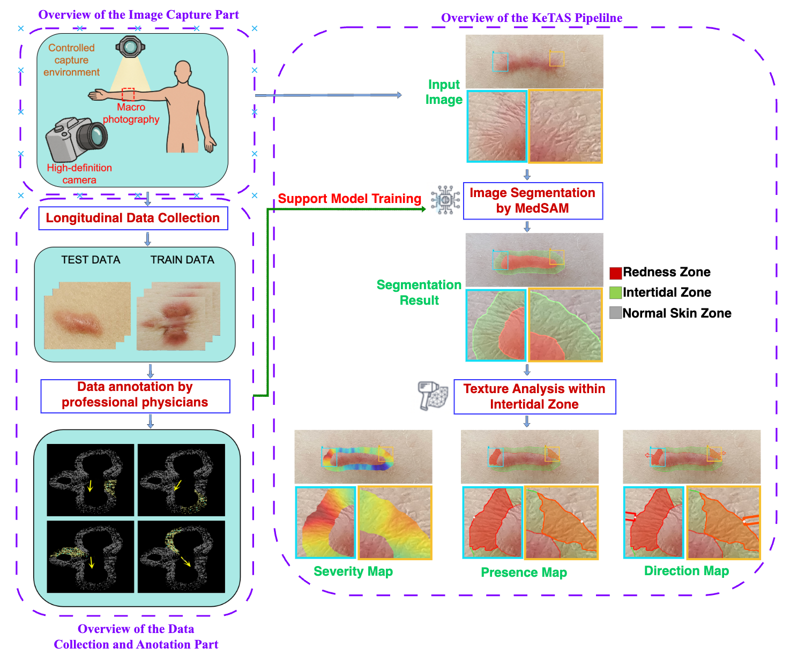
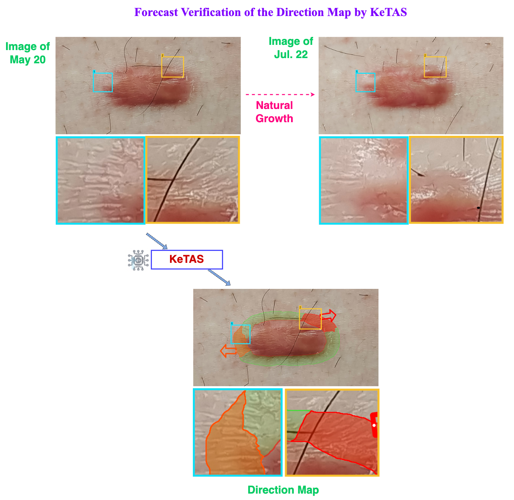
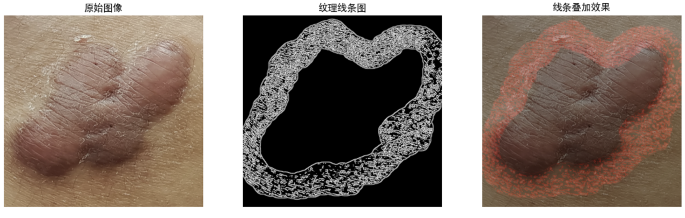

# Introduction

Keloids, as the typical cutaneous pathological scars, serve as the hub connecting soft tissue fibrosis and tumors[^1]. On the one hand, the histological features of excessive connective tissue deposition in the reticular dermis confined keloids within fibrotic disease[^2]; while on the other hand, their quasi-neoplastic behaviors such as the lifelong aggressive invasion into the adjacent healthy skin beyond initial injury/infection and frequent post-therapeutic recurrence highlight keloids as the most severe type of fibroproliferative conditions1, with the only differences from cancers in having no atypia or intrinsic metastasis. Specifically, keloid invasion is closely related to local mechanics, as supported by the fundamental explorations in mechanobiological mechanisms (e.g. mechanoresponsive gene of asporin[^3] and mechanosignaling of Wnt/β-catenin[^4]) and clinical effectiveness of serial tension-releasing mechanotherapeutic strategies[^5] (e.g. incision with minimized tension[^6] and square-flap surgery[^7]). Thus, to trace dynamic changes thereby discovering rules behind keloid local invasion in response to real mechanical scenarios *in vivo* will benefit both fibrosis and cancer fields.

Until now, the etiology of keloidogensis remains unclear and the therapeutic effects remain limited. Thus, there is a surging demand for ealy diagnoses of its initiation/recurrence and progression, aiming at early, sensitive, accurate, repeatable and traumaless local diagnostic indices. Unfortunately, the available evaluation of keloidgoenesis currently are still confined within unfocused all-inclusive methods, such as 1) static and morphological gradings of keloid size, shape and erythema, as well as 2) the subjective symptom scores in varied scales[^8] \[e.g. Vancouver scar scale (VSS), Patient and observer scar assessment scale (POSAS), and Japan scar workshop (JSW) scar scale (JSS)[^9]\], the results of which can only be verified by the post-surgical histological reports and can hardly meet the clinical requirements during the life-long invasion. Specifically, traditional quantitative diagnosis in other disease models focusing on dose-effect relationship and threshold assessments are difficult to implement during keloidogenesis, because the disease grading and staging in keloids are unattainable. Actually, the challenge lies in that the local invasions with minute externalized changes in the surface of skin during keloidogensis can hardly be arrested by traditional assessments such as systemic blood sampling, deep radiological evaluations, rough superficial soft tissue ultrasound examinations, or late histological testings. Thus, a novel diagnostic system form scratch out of the available clinical evidences for ealy diagnostic indices is in thirsty need for intricate quantifications to monitor and analyze the keloid local invasion in a non-invasive, sensitive, dynamic, real-time, customized, and self-verifiable style.

<mark>According to the dynamic clinical obervations, we noticed that during the progressive streching-induced growth of keloids, the skin surface texture surrounding the keloids undergoes changes from an indiscintct stage to full emerge, as exemplified in Fig. 1. Brifely, during the continuous invasion of keloids into the adjacent healthy skin under chronic mechanical stimulations, the shape of the single hair follicle changed from round into fusifum. Gradually, these dotted deformed hair follicles presented in a dash-line style while acturally separated from one another. Further, the hair follciles begin to selectively border each other under the help of protrusion of skin textures, untilly finally the skin textures can be differentiated with naked eyes where the long axis of the fusiform is passed through by the skin texture along the direction of mechanical stimulations. If so, for these keloid-specific dynamic evolution of skin textures, it is hypothesized that the intricate skin textures, if dynamically and objectively evaluated, can demonstrate the existence, range, and extent of keloidogenesis, and even predict the direction of keloid invasion, under the help of artificial intelligence (AI).</mark>

**<mark>Fig. 1. The captured dynamic formation of skin texture during keloidogenesis</mark>**

<mark>During the continuous invasion of keloid into the adjacent healthy skin, there accompanied dynamic process of the emergence of skin textures around the invasion edge. In responsive to the local mechanical stretching, the shape of the single hair follicle changed from round (1) into fusifum (2). Gruadually, the original regular lattic pattern of dotted hair follicles differentiated into a dash line arrangement (3), though leaving each fusiform separated with eath other. Further, the progressively elongated and flattened fusiform began to border with adjacent neighbors selectively under the help of protrusion of skin textures (4). And finally skin textures fully formed (5) if the continuously deepened and thicked textures can be traced by naked eys when they connect each hair follilcle passing through the long axis of the fursiform along the direction of mechanical stimulations.</mark>

In recent years, ‘AI for medicine’ has achieved remarkable results in targeted and precise evaluations. Large foundation model of MedSAM advance medical image segmentation, benefiting local analysis of skin cancers (UWSkinCancerMSBench), local annotation of CT data *\[AbdomenAtlas-8K: Annotating 8,000 CT Volumes forMulti-Organ Segmentation in Three Weeks, NeurIPS 2023\]*, and local analysis of 3D pathology <mark>samples</mark>[^10]. Large foundation model of Mixture of MOdality Experts(MOME) further shows promising results in local analysis of breast cancer of MRI[^11]. Compared with traditional methods, these AI technologies offer non-invasive, objective, and accurate alternatives, which built a base for exploration of the intuitive, easily accessible skin surface features of keloids, and tailored models for keloid invasion assessment.

In this paper, we develop an assessment index to capture explicit local morphological indicators during keloidogenesis, including the presence, spatial extent, severity, and candidate direction of keloid invasion, through AI-assisted local skin-texture analysis. First, high-definition images are acquired to preserve fine texture features. Second, a three-class U-Net segments normal skin, the intertidal zone, and the keloid body. Third, Gabor-gradient-domain analysis is applied within the post-processed effective intertidal zone to generate the Severity Map, Presence Map, and Direction Map. These outputs can support clinical assessment of the location, relative intensity, and candidate propagation direction of keloid invasion, subject to the calibration and validation limits specified in the Methods.

# Results

Association between skin textural structure and keloid invasion:

Out of the first-hand clinical evidences, we discover an association between skin textural structure and keloid invasion, facilitated by experienced clinicans specializing in keloid managements. Clinical information demonstrated by skin textural structures at the periphery of keloid during its local invasion include: (1) the skin textural structure crosses the boundary between the redness of keloid invasive periphery and the adjacent normal skin thereby covering both sites (Fig. 3a), which we named Intertidal Zone (IZ); (2) the originally parallelized-arranged skin texture can be squeezed into concentric circles centripetal towards keloid center or radiantly arranged outward into the adjacent healthy skin (Fig. 3), the latter of which indicating active aggressiveness (Fig. 3b); (3) the radiantly arranged skin texture is frequently seen in the invasive front, which is consistent with direction of the local mechanical stimulation and the typical site-oriented keloid shape (e.g. butterfly in the chest) (Fig. 1b); and (4) as the dynamic and responsive reaction to the chronic local mechanics, the instant skin textural changes in morphology precede the histological structural manifestations, thereby potentially externalizing the missing link between the functional mechanical stimulation and the manifested structural mass formation.

KeTAS:

We developed an AI-driven statistical analysis system for predicting keloid invasion, termed the Keloid Textural Analysis System (KeTAS) (Fig. 2). The system consists of three core modules: an image acquisition module designed to capture high-resolution, detailed skin surface textures; an image segmentation module that distinguishes the intertidal zone from normal skin and the keloid body; and a Gabor-gradient feature analysis module that operates on the segmented intertidal zones to enable accurate, generalizable, and reliable prediction of keloid invasion.

Compared with fully end-to-end AI approaches, KeTAS emphasizes interpretability and reproducibility by decomposing the pipeline into U-Net-based three-class segmentation and explicitly defined Gabor-gradient-domain feature analysis. The segmentation model uses manually annotated regional labels, while the downstream texture indicators are calculated using deterministic computer-vision operations. This design makes the origin of each quantitative output traceable while retaining a learned model for anatomical region partitioning.

Notably, KeTAS allows comprehensive assessment of keloid invasion, including its presence, distribution, severity, and direction, which is far more informative than existing conventional clinical evaluation. More importantly, KeTAS makes it possible to quantify the presence, direction, and severity of keloid invasion in a non-invasive, sensitive, dynamic, real-time, personalized, and self-verifiable manner.

Accordingly, KeTAS holds great potential to assist clinicians in identifying keloid invasion for early diagnosis, assessing its spatial range and degree for treatment planning, and further predicting its invasive direction to guide preventive interventions.

**Fig.2. Pipeline of KeTAS**

The pipline include data capture, data annotation, and data processing (segmentation with Gabor-gradient domain analysis). The system obtains a novel index of intertidal zones and three indicators of presence, direction, and severity of keloid invasion. 2026

Ke-Index and three indicators:

Using KeTAS, Ke-index is obtained with the following three medical diagnostic indicators:

Indicator 1: The indicator of the presence of keloid invasion (whether the keloid is growing), derived from the presence or absence of IZs.

> Original draft note: add an example after running segmentation to obtain a binary mask map of shape `(h, w, 1)` and calculate presence for each region.

Indicator 2: The indicator of severity of keloid invasion, derived from the ratio of IZ area to total keloid area (the total keloid area is also segmented using KeTAS).

> Original draft note: add an example showing the activity of eight regions.

Indicator 3: The indicator of the direction of keloid invasion, derived from KeTAS texture-direction analysis within the segmented IZs.

> Original draft note: add an example.

**Fig.3. Verification of KeTAS**

> Original draft note: revise this description using the new figures and segmentation/direction results.

Verification: Sensitivity, accuracy, and repeatability of those indicators have been repeatedly verified during the dynamic processes of clinical observations and evaluations. (1) **Sensitivity**. The *dyanamic* skin texture highly sensitive and responsive to local motions in an instable way, when repeatedly operated for a long-enough period, can solidify into *static* skin textures and externally presented as stable signals. Such early signals can be captured by our system when initially appeared, before the traditional and late histological evidences can be manifested meaningful. (2) **Validity**. The assessments of keloid invasion for each invividual from the perspectives of its existence, severity and dirction have been extended for additional 6 months, aside from the standard obervasion period, which allows for presenting thereby verifying the skin texture assessment of the local invasion in a dynamic way to ensure the accuracy of our evaluations. (3) **Repeatibility**. For all the patients, whatever therapeutic strategies they prefer and finally choose, pharmaceutical palliative treatment or surgical resection followed by postherapeutic radiation therapy (Figures), the development, invasion or recurrence of keloidogensis was cross-validified accordingly as mentioned in (2) to guarentee the assessment homogeneity among different locations and courses of the disease, as well as different patient individuals, genders, and ages, at the least under the current research capacity. And (4) **Reliability.** The reliance on specialized imaging hardwares such as camera and lens is low during image acquisition in our system. Additionally, the topical interference during figure recognition is minimal for non-dermatoglyphic confounding variables such as hair strand, skin debris, and topical drug residues. Under such deliberatedly guided superior signal-to-noise ratios, the reliability dermatoglyphic assenssment afterwards can be enhanced accordingly.

# Discussion

> Original structure note: the Results section includes (1) automated skin-texture/keloid analysis by KeTAS, (2) the clinically observed association between skin texture and keloids, and (3) the intertidal-zone index and three indicators.

1: Significance of the Combination of AI and Gabor-gradient domain analysis

KeTAS proposes a hybrid strategy combining artificial intelligence (AI) and traditional visual texture analysis in the Gabor-gradient domain, which addresses limitations of current mainstream methods [references to be added]. Although purely learned approaches in medical diagnosis have made considerable progress, they can require extensive training data and may provide insufficiently interpretable or reliable results. In contrast, traditional visual analysis methods offer stronger interpretability and stability but have limited ability to learn disease-specific regional representations from annotated data.

This study combines complementary methods through task decoupling. A three-class U-Net is trained on carefully annotated keloid images to segment normal skin, the intertidal zone, and the keloid body. For texture-axis analysis, where large-scale reliable pixel-level directional annotations are unavailable, deterministic Gabor filtering, edge extraction, and structure-tensor analysis are used instead of a second learned model. This separation uses supervised learning where regional labels are feasible and explicit feature engineering where traceability and directional interpretation are essential.

2: Significance of Objective Quantitative Diagnosis

The diagnosis of keloids has long relied on subjective clinical evaluation; even a few objective indicators are highly dependent on physicians' experience, leading to significant differences in diagnostic results among different medical institutions and physicians, which seriously restricts the standardized development of the field. Our developed KeTAS and standardized analysis method greatly reduce the reliance of diagnosis on subjective judgment, realize consistent diagnosis across institutions and physicians, provide a key technical path for the standardization of keloid diagnosis, and offer strong support for the large-scale promotion, cost control, and efficiency improvement of the diagnosis and treatment of this disease.

3: Significance of the Strong Correlation Between Skin Texture and Keloid Invasion

One of the core findings of this study is the existence of a strong correlation between skin texture morphology and keloid invasion, which has not been reported in the field. This finding not only provides a new quantitative tool for evaluating the degree (intensity and direction) of keloid invasion but also offers important clues for analyzing the pathogenesis of the disease, opening up a new direction for exploring the inherent laws of the occurrence and development of the disease.

4: Significance of Effective Clinical Self-Validation

The results of clinical dynamic self-validation confirm that the newly discovered intertidal zone Ke-index and the three indicators of presence, severity, and direction of keloidogenesis have good effectiveness. This not only verifies the reliability of the technical scheme proposed in this study but also fully confirms the scientificity, accuracy, and efficiency of the entire process, including data collection, processing, analysis, and the calculation of indexs and indicators. Furthermore, it proposes new indicators for predicting the degree and direction of the chronic invasion process of keloids, laying a solid foundation for subsequent clinical transformation.

### 5. Why observe skin texture rather than earlier changes in individual hair follicles?

> Original title note: sufficiency, necessity, and earliest recognizability.

<mark>Currently we evaluated the dynamic changes in skin textures during keloidogenesis, rather than the earlier single hair follicles, because (1) During the mechanic-dependent formation of skin textures, it is only after the full emergence of skin textures, can the most impacted and affected hair follicles be decided, with their fusiform shape stabilized and long axis run through the detected skin textures on after another; (2) It is the continuous and fixed skin textures that can be differentiated by naked eyes or pictures taken, while the instable and demarcated hair follicles in lattic or slightly deformed pattern in the entire field served more as interference than contributing factors; (3) It is the full-formed clustered skin textures that help provide collectively the informative patterns through various distribution patterns (Fig. 5). And the longer the keloid course, the thicker, longer, and typical the skin textures will be in facilitating clinical decision-making. For examples, the concentric circle districution of skin textures around keloid edges indicated less invasion than radiant arrangement where the invasion direction was being selected. And it was not until the parallel-patterned skin textures be formed can the true ingrowth of the red keloid be recognized, along the decided invasion direction indicated by the collective paralleled alignment of skin textures.</mark>

<mark>Fig. 5. The recognized clustered skin textures can provide invasion-related inforamtion through their distribution patterns</mark>

<mark>The recognizable skin textures function as the dynamic and responsive reaction to the chronic mechanical stimulations during local keloid invasion. Thus, the instant skin textural changes precede the histological structural outcomes. Initially, the concentric circle districution of skin textures around keloid edges (①) indicated less invasion than radiant arrangement (②) where the invasion direction was being selected. And it was not until the parallel-patterned skin textures (③) be formed can the true ingrowth of the red keloid be recognized, along the decided invasion direction indicated by the collective paralleled alignment of skin textures. And accordingly, keloid growth is along the directional trail indicated by skin texture, as shown by the gradual changes within red, organ, and pink boxes, towards additional keloid tissue formation, thereby potentially externalizing the missing link between the functional mechanical stimulation and the manifested structural mass formation during keloidogenesis.</mark>

### Essential qualifications to add to the Discussion

#### 1. Self-validation in the absence of a gold standard

<mark>Though hardly can dynamic histological verification be feasible as golden standard to match our KeTAS results, the self-verifications, both static and dynamic, are proved credible and effective. Statically, inside the intertidal zone, the three indictors of presence, severity, and direction, separately deducted by KeTAS automatically, can fullfill the loop through cross-validications among the three, with progressive refresh and refinement. Further outside the intertidal zone, our direction index for coming invasion is echoed by the long axis of fusiform-shaped hair follicles in the ajacent healthy skin, although their sensitivity can outweigh specificity as collateral evidences. And dynamically, all the three indicators can have their factual evidences for direct confirmation during the continuous obervations where keloid invasion is truly following what the KeTAS direction indicates earlier. Such an abiding behavior is additionally supported by the visible enlargement and edema of the keloid mass in designated area and direction.</mark>

#### 2. Why longitudinal observation can provide sufficient images without compromising patient interests

<mark>Our clinical obervations of the skin textures are available during daily standarized keloid managements (e.g. external phamaceuticals, laser therapy, costosterioid injection, or surgery following by irradiation) according to the preference of the patients and feasibility for the treatments, aiming to benefit the patient to the most. Considering that keloid can resulted from minute folliculitis or after trauma/surgery with frequent post-surgical recurrence, the KeTAS is particularly suitable for those: (1) with their preference for conservative treatments, especially those with family history; (2) with refractory keloids and multiple post-surgical recurrences; and (3) with multiple spreading and progressively new lesions.</mark>

6: Future Extended Applications of This Work

The KeTAS proposed in this study provides a feasible scheme for the standardization of keloid skin texture analysis and diagnosis, with significant potential application value—it is expected to become a routine non-invasive, sensitive, dynamic, real-time, personalized, and self-verifiable objective evaluation tool in clinical practices such as keloid diagnosis, treatment, and prevention (corresponding to the positioning of "a non-invasive, sensitive, dynamic, real-time, customized, and self-verifiable way" in the Introduction section), similar to the standardized status of platelet detection in blood tests. Promoting the KeTAS system and the corresponding Ke-index with the three indicators to medical institutions at all levels can realize the unification and standardization of the keloid diagnosis process, provide credible and high-quality diagnostic basis for the majority of patients, build a low-cost and high-efficiency social medical foundation for keloid diagnosis, and help upgrade and improve the medical system in the field of diagnosis and treatment of this disease.

<mark>Such a keloid-specific KeTas system by skin textures are endowed with characteristic features. (1) *<u>Morphological manifestation of functions</u>*. As a mechano-sensitive and -responsive disease, keloid demonstrates stretching-dependent invasion. The mechanic stimulations include mainly contraction of underlying skeletal muscles, meanwhile covering hearbeating and breathing with fixed rhythm and frequency. Such complex functions of movements can hardly be monitored independently, not to say be packaged into a meaningful group. Fortunately, those functional changes can be traced in the superficial skin textures and explicated by our KeTAS system through morphological manifestations. (2) *<u>Static manifestation of dyanmic invasion</u>*. The quasi-neoplastic continuous invasion is the iconic feature of keloid as benign fibrotic disease. The presence, distribution, severity, and direction of such dynamic processes can be collectively catptured and reflected as perodic pictures in the statical forms of changes in density, depth, thickness and direction of skin textures. (3) *<u>Quantifiable manifestation of highly differentiated features</u>*. In contrast to the traditional subjective evaluation of keloid severity through qualified or semi-quantified questionnaire, the recognizable and traceble skin textures can provide objective information thorugh our KeTAS system. (4) *<u>Early capture of invasion information</u>*. Traditional golden standard of keloidogenesis is the histological findings of hyalinized collagen fiber under the microscope by pathologists after surgical excision. Such a lagging histological finding merely for diagnosis is too late meanwhile far from the practical expectations towards traumaless diagnosis, non-invasive intervention, and early prediction before true growth happens, for which KeTAS can provide full solutions.</mark>

Besides, our KeTAS provides a paradigm with static skin texture as an early diagnostic system of disease progression integrating the qualitative (to initiate or not), quantitative (the severity) and directional information, meanwhile covering the whole course of the disease and varied therapeutic strategies. Additionally, it is applicable not only in disease diagnosis, but can also guide selecting prophylactic procedures and modifying therapeutic strategies for both doctors and patients. Thanks to the advances in AI, the successful applications of our KeTAS during keloidogensis in the largest and most superfical organ of skin inside human body indicate a promising future for development potentials in other chronic diseases and organs with the striae-like apperances, such as fibrosis or tumors, where keloids serve as a hub connecting through not only the invasion behavior but also morphological indicators.

<mark>Indeed, the keloid-specific skin textures provides a typical link between scar mechanobiology as fundamental explorations and scar mechanotherapy as practical applications. Under the dyamic evaluations thorugh skin textures around keloids to the local mechanics, KeTAS can (1) provides sufficient information to diagnosis, therapeutics and prophylasixs for clinical decision-making, which can radically upgrade the theragnostic strategies in patholcial scars; (2) provides a typical demonstration for fibrosis and tumors to learn. Keloids are the typical example of dermal fibrosis demonstrating quasi-neoplasctic featues. As long as the continuous invasion can be monitored and evaluated during keloidogenesis, the KeTAS system can be borrowed into fibrogenesis and tumorigenesis, to ignite more fascinating findings and applications.</mark>

# 4. Methods

This study enrolled `xxx` adult outpatients with keloids located on the chest, scapular region, or abdomen who received clinical care at Beijing Tsinghua Changgung Hospital between `xxxx` and `xxxx`. Standardized macro photography was performed at every follow-up to document longitudinal changes in the keloid and surrounding skin texture. The final manuscript must replace these placeholders with the actual participant count, study dates, ethics approval number, and informed-consent procedure.

Based on the clinically observed association between skin-texture structure and keloid invasive progression, we developed the **Keloid Texture Analysis System (KeTAS)**. It comprises standardized image acquisition, three-class semantic segmentation using a U-Net, and Gabor-gradient-domain texture analysis. The system produces a Severity Map, Presence Map, and Direction Map to describe, respectively, the within-image relative intensity, spatial distribution, and candidate propagation direction of texture abnormalities in the intertidal zone.

The pipeline uses task decoupling. A U-Net trained on manual annotations first separates the image into normal skin, intertidal zone, and keloid body. Conventional computer-vision methods are then applied only within the post-processed effective intertidal zone to extract texture lines, estimate local texture axes, and calculate regional indicators. Because severity is normalized independently within each image, it should initially be interpreted as a within-image relative measure rather than an uncalibrated absolute clinical quantity that can be compared directly across patients.

## 4.1 Keloid image acquisition

The target keloid and surrounding skin were centered in the frame and recorded by high-definition macro photography to preserve skin-texture detail. For pixel-scale parameters and longitudinal comparisons to remain interpretable, the final study protocol should standardize and report the camera and lens models, shooting distance, image resolution, illumination and color temperature, camera angle, white balance, skin-tension state, and a physical scale reference. Without such standardization, pixel radii used in this study are image-scale parameters and cannot be converted directly into a common physical distance.

**Figure 5. Example of three-class segmentation using the U-Net model.**

The area outside the green curve is normal skin, the area between the green and red curves is the intertidal zone, and the area inside the red curve is the keloid body.

## 4.2 Keloid region segmentation

### 4.2.1 Annotation and class definitions

Each input image was partitioned into three mutually exclusive classes: class 0, normal skin; class 1, intertidal zone (annotation field `KELOID_BOUNDARY`); and class 2, keloid body (annotation field `KELOID_BODY`). With clinical assistance, classes 1 and 2 were annotated using polygons, and pixels not covered by either polygon were assigned to class 0. During label generation, class 2 took precedence wherever its polygon overlapped class 1.

### 4.2.2 U-Net architecture and training

We used a standard U-Net.[^12] RGB inputs were resized bilinearly to $256\times256$ pixels. The encoder contained five double-convolution stages with 64, 128, 256, 512, and 1024 output channels. Each stage comprised two sequences of a $3\times3$ convolution, batch normalization, and ReLU activation. The encoder used $2\times2$ max pooling for downsampling. The decoder used transposed convolutions with kernel size and stride 2 for upsampling and concatenated the corresponding encoder features through skip connections. A final $1\times1$ convolution produced logits for three classes.

Let $z_{p,c}$ denote the model output at pixel $p$ for class $c\in\{0,1,2\}$. The pixel-level class probability and predicted label were

$$
P_{p,c}=\frac{\exp(z_{p,c})}{\sum_{r=0}^{2}\exp(z_{p,r})},
\qquad
\widehat y_p=\arg\max_c P_{p,c}.
\tag{1}
$$

Training used multiclass cross-entropy loss:

$$
\mathcal L_{\mathrm{CE}}
=-\frac{1}{|\mathcal P|}
\sum_{p\in\mathcal P}\log P_{p,y_p},
\tag{2}
$$

where $\mathcal P$ is the set of training-image pixels and $y_p$ is the ground-truth class. The Adam optimizer was used with a learning rate of 0.001, batch size of 8, and maximum of 100 epochs. Data were split into training and validation sets at 80% and 20%, using random seed 42. Brightness, contrast, saturation, and hue perturbations could be applied to training images, while validation images received no color augmentation. Early stopping monitored validation loss with a patience of 20 epochs.

At inference, the predicted label map was restored to the original image dimensions using nearest-neighbor interpolation. Downstream intertidal-zone analysis used the class-1 mask, while the class-2 mask defined the spatial anchor of the keloid body.

### 4.2.3 Effective intertidal-zone post-processing

Let $M_0$ be the binary class-1 mask predicted by U-Net and $H$ the image height. The effective intertidal-zone mask used for texture analysis was obtained as follows:

$$
M_c=\operatorname{Close}(M_0,E_5),
\tag{3}
$$

$$
M_e=\operatorname{Dilate}
\left(M_c,E_{2\lfloor H/30\rfloor+1}\right),
\tag{4}
$$

$$
M=\operatorname{LCC}_8\!\left[
\operatorname{Erode}
\left(M_e,E_{2\max(1,\lfloor H/80\rfloor)+1}\right)
\right],
\tag{5}
$$

where $E_k$ is a $k\times k$ elliptical structuring element and $\operatorname{LCC}_8$ retains only the largest 8-connected component. The expanded mask $M_e$ constrains the initial region of interest for Gabor analysis, whereas the final effective mask $M$ constrains texture lines, severity, and orientation calculations. Thus, downstream analysis does not operate directly on the unprocessed class-1 prediction.

## 4.3 Gabor-gradient-domain skin-texture analysis

### 4.3.1 Gabor texture extraction

Let $I$ be the original RGB image. The expanded intertidal-zone mask first defines the region-of-interest image:

$$
I_{\mathrm{ROI}}(p)=I(p)M_e(p).
\tag{6}
$$

We used four orientations and two wavelengths:

$$
\Theta=\left\{0,\frac{\pi}{4},\frac{\pi}{2},\frac{3\pi}{4}\right\},
\qquad
\Lambda=\{10,15\}\ \text{pixels}.
\tag{7}
$$

The filter bank therefore contained $4\times2=8$ Gabor kernels, rather than 12. For local coordinates $(x,y)$, the rotated coordinates were

$$
x'=x\cos\theta+y\sin\theta,
\qquad
y'=-x\sin\theta+y\cos\theta.
\tag{8}
$$

The real-valued Gabor kernel was

$$
g_{\theta,\lambda}(x,y)=
\exp\!\left[-\frac{x'^2+\gamma^2y'^2}{2\sigma_g^2}\right]
\cos\!\left(2\pi\frac{x'}{\lambda}+\psi\right),
\tag{9}
$$

with a $9\times9$ kernel, $\sigma_g=3.0$, $\gamma=0.5$, and $\psi=0$. In the implementation, each kernel was divided by $1.5\sum_{x,y}g_{\theta,\lambda}(x,y)$ before convolution. Responses were converted to grayscale, summed linearly, and min-max normalized to $[0,255]$:

$$
F_A=255\,
\frac{F_\Sigma-\min(F_\Sigma)}
{\max(F_\Sigma)-\min(F_\Sigma)},
\qquad
F_\Sigma=\sum_{\theta\in\Theta}
\sum_{\lambda\in\Lambda}
\operatorname{Gray}(I_{\mathrm{ROI}}*g_{\theta,\lambda}).
\tag{10}
$$

If $\max(F_\Sigma)=\min(F_\Sigma)$, the normalized result should be set to zero to avoid division by zero.

OpenCV Gaussian adaptive thresholding was then applied with an $11\times11$ neighborhood and constant $C=2$:

$$
F_B(p)=
\begin{cases}
255, & F_A(p)>\mu_G^{11\times11}(p)-2,\\
0, & \text{otherwise},
\end{cases}
\tag{11}
$$

where $\mu_G^{11\times11}(p)$ is the Gaussian-weighted local mean around pixel $p$. Canny edge detection with lower and upper thresholds of 50 and 150 was followed by one dilation using a $3\times3$ all-ones structuring element:

$$
F=\operatorname{Dilate}
\left(\operatorname{Canny}(F_B;50,150),\mathbf 1_{3\times3}\right)\odot M.
\tag{12}
$$

Here $\odot$ denotes pixel-wise multiplication. $F$ is a single-channel texture-line image at the original image dimensions, with pixel values strictly equal to 0 or 255. It is saved directly as lossless PNG without a Matplotlib canvas, antialiasing, or resampling.

**Figure 6. Example texture lines extracted within the intertidal zone using Gabor filtering, adaptive thresholding, and Canny edge detection.**

### 4.3.2 Structure tensor and pixel-level texture axis

Horizontal and vertical gradients were calculated on the single-channel texture-line image $F$ using the Scharr operator:

$$
G_x=\operatorname{Scharr}_x(F),
\qquad
G_y=\operatorname{Scharr}_y(F).
\tag{13}
$$

Only gradients within the effective intertidal-zone mask $M$ were retained. We defined

$$
J_{11}=G_{\sigma_s}*(G_x^2),
\qquad
J_{22}=G_{\sigma_s}*(G_y^2),
\qquad
J_{12}=G_{\sigma_s}*(G_xG_y),
\tag{14}
$$

where $G_{\sigma_s}$ is a two-dimensional Gaussian kernel:

$$
G_{\sigma_s}(p,q)\propto
\exp\!\left(-\frac{\|p-q\|_2^2}{2\sigma_s^2}\right),
\qquad
\sigma_s=\max\!\left(3,
\left\lfloor\frac{\min(H,W)}{100}\right\rfloor\right).
\tag{15}
$$

The Gaussian kernel side length was $6\sigma_s+1$. The structure tensor at pixel $p$ was

$$
J(p)=
\begin{bmatrix}
J_{11}(p)&J_{12}(p)\\
J_{12}(p)&J_{22}(p)
\end{bmatrix}
=V(p)
\begin{bmatrix}
\lambda_1(p)&0\\
0&\lambda_2(p)
\end{bmatrix}
V(p)^{\mathrm T},
\quad \lambda_1\geq\lambda_2.
\tag{16}
$$

The structure-tensor energy was defined as $E(p)=\lambda_1(p)+\lambda_2(p)$, with $E_{\mathrm{th}}=\max[\epsilon_{32},10^{-6}\max_{q\in M}E(q)]$, where $\epsilon_{32}$ is the machine epsilon of a 32-bit floating-point number. Orientation was retained only where $M(p)=1$ and $E(p)>E_{\mathrm{th}}$; all other pixels were marked as having invalid orientation.

The unit eigenvector $v_1$ associated with the largest eigenvalue $\lambda_1$ indicates the direction of strongest local grayscale change, which is normal to the texture line rather than tangent to it. The texture tangent and undirected texture-axis angle were therefore defined as

$$
t(p)=
\begin{bmatrix}0&-1\\1&0\end{bmatrix}v_1(p),
\qquad
\theta(p)=\operatorname{atan2}(t_y(p),t_x(p))\bmod\pi.
\tag{17}
$$

The $90^\circ$ rotation in Eq. (17) is essential: treating $v_1$ directly as the texture orientation would confuse the texture normal with the texture tangent. The energy constraint excludes arbitrary eigenvectors produced by a zero structure tensor in flat regions.

**Figure 7. Example structure-tensor texture-orientation estimation and supplementary eight-sector visualization.**

The supplementary eight-sector visualization partitions the image into eight $45^\circ$ sectors by polar angle about the image center. Texture density and directional concentration are summarized within each sector to aid visualization of the global spatial distribution. The pixel-level Severity Map and Worst Area extraction do not require selection of a sector.

## 4.4 Quantitative indicator computation

### 4.4.1 Local texture density

Because $F$ is an unresampled binary texture-line image with values 0 and 255, each nonzero pixel is used directly as a texture point without an additional empirical threshold:

$$
T(p)=\mathbb I[F(p)>0]M(p).
\tag{18}
$$

Local statistics use a disk kernel rather than a square all-ones kernel:

$$
K_r(u,v)=\mathbb I[u^2+v^2\leq r^2].
\tag{19}
$$

When a fixed radius is not specified, the radius is scaled by the shorter image dimension:

$$
r=\operatorname{clip}\!\left(
\operatorname{round}\left[80\frac{\min(H,W)}{920}\right],
12,96
\right).
\tag{20}
$$

Local texture density is

$$
D_s(p)=
\frac{(T*K_r)(p)}{(M*K_r)(p)},
\qquad (M*K_r)(p)>0.
\tag{21}
$$

$D_s(p)$ is set to zero when the denominator is zero. The analysis software also permits a fixed radius instead of Eq. (20).

### 4.4.2 Local orientation consistency

Texture orientation is an undirected axis with period $\pi$. Let $V(p)=\mathbb I[\theta(p)\ \text{is valid}]M(p)$ indicate pixels with valid orientation. Doubled-angle vectors remove the discontinuity between $0^\circ$ and $180^\circ$:

$$
C_2(p)=\cos[2\theta(p)]V(p),
\qquad
S_2(p)=\sin[2\theta(p)]V(p).
\tag{22}
$$

Within the disk neighborhood,

$$
\bar C_2(p)=\frac{(C_2*K_r)(p)}{(V*K_r)(p)},
\qquad
\bar S_2(p)=\frac{(S_2*K_r)(p)}{(V*K_r)(p)},
\tag{23}
$$

and

$$
D_c(p)=\sqrt{\bar C_2(p)^2+\bar S_2(p)^2},
\qquad (V*K_r)(p)>0.
\tag{24}
$$

$D_c\in[0,1]$. Values near 1 indicate that local texture axes are concentrated, whereas values near 0 indicate dispersed orientations. The denominator is the number of orientation-valid pixels after structure-tensor energy filtering, not the fixed window area.

Importantly, $D_c$ measures directional concentration rather than the mean texture orientation itself. Writing the two components in Eq. (23) in complex form gives

$$
\bar R_2(p)=\bar C_2(p)+\mathrm{i}\bar S_2(p)
=\frac{1}{N_p}\sum_{q\in B_r(p)}V(q)\exp[\mathrm{i}2\theta(q)],
\tag{24a}
$$

where $N_p=(V*K_r)(p)$. If every texture axis in the neighborhood is rotated by the same angle $\alpha$, so that $\theta'(q)=\theta(q)+\alpha$, then

$$
\bar R'_2(p)=\exp(\mathrm{i}2\alpha)\bar R_2(p).
\tag{24b}
$$

Because $|\exp(\mathrm{i}2\alpha)|=1$,

$$
D'_c(p)=|\bar R'_2(p)|
=|\bar R_2(p)|
=D_c(p).
\tag{24c}
$$

Thus, rotating a texture pattern from, for example, $45^\circ$ to $90^\circ$ leaves $D_c$ unchanged if dispersion about the mean orientation is unchanged. The mean texture axis is given separately by

$$
\bar\theta(p)=\frac{1}{2}\operatorname{atan2}\!\left(\bar S_2(p),\bar C_2(p)\right)\pmod{\pi}.
\tag{24d}
$$

A global rotation changes $\bar\theta$ by $\alpha$ but does not change $D_c$. Mean orientation therefore describes the axis along which texture is aligned, whereas consistency describes how tightly texture is concentrated around that axis. The absolute mean-orientation angle does not enter the severity score directly; orientation contributes to severity only through local concentration. This invariance applies specifically to the orientation-consistency term and does not imply that the complete image-analysis pipeline is strictly invariant to every rotation, crop, or segmentation change.

### 4.4.3 Severity Map

Let the user-specified density and consistency weights be $w_s$ and $w_c$. The effective weights are normalized as

$$
d_w=\frac{w_s}{w_s+w_c},
\qquad
c_w=\frac{w_c}{w_s+w_c},
\qquad w_s+w_c>0.
\tag{25}
$$

The defaults are $w_s=0.7$ and $w_c=0.3$, giving $d_w=0.7$ and $c_w=0.3$. Raw severity is

$$
S_{\mathrm{raw}}(p)=
\left[d_wD_s(p)+c_wD_c(p)\right]M(p).
\tag{26}
$$

For Severity Map generation, values are independently min-max normalized within the effective intertidal zone of each image:

$$
S(p)=
\begin{cases}
\dfrac{S_{\mathrm{raw}}(p)-S_{\min}}
{S_{\max}-S_{\min}},&p\in M,\ S_{\max}>S_{\min},\\[6pt]
0,&\text{otherwise},
\end{cases}
\tag{27}
$$

where $S_{\min}$ and $S_{\max}$ are the minimum and maximum raw severities within the effective intertidal zone of that image. This normalization gives $S\in[0,1]$, but also means that $S$ represents within-image relative severity. Without additional calibration, the same $S$ value in different images should not be interpreted as the same absolute degree of invasion.

### 4.4.4 Presence Map

The Presence Map assigns colors to levels of $S$ within the effective intertidal zone. For ascending thresholds $t_1<\cdots<t_{L-1}$, the level label is

$$
P(p)=
\begin{cases}
0,&S(p)\leq t_1,\\
\ell,&t_\ell<S(p)\leq t_{\ell+1},\quad 1\leq\ell<L-1,\\
L-1,&S(p)>t_{L-1},
\end{cases}
\qquad p\in M.
\tag{28}
$$

Thresholds may be specified directly as scores in $[0,1]$ or derived from percentiles of the severity distribution within the intertidal zone. The analysis interface uses two levels by default, with the 80th percentile as the boundary; the highest level is always displayed in red. The Presence Map is a level-based visualization and is distinct from the connected-component-based Worst Areas described below.

### 4.4.5 Worst Area extraction

To localize the principal high-risk regions, the $q$th percentile of severity within the effective intertidal zone is first calculated:

$$
T_q=Q_{q/100}\{S(p):M(p)=1\},
\qquad
H_q(p)=\mathbb I[S(p)\geq T_q]M(p).
\tag{29}
$$

The default is $q=80$, so the candidate high-score map contains approximately the highest-scoring 20% of intertidal-zone pixels. Two regions are extracted by default, and the software permits 1 to 5 regions.

For a candidate square of side length $B$ centered at $c$, let $\mathcal B(c)$ be its pixel set. A candidate must lie entirely inside the image, have its center inside $M$, and preferentially satisfy a minimum mask coverage of $\rho=0.30$:

$$
R_{\mathrm{overlap}}(c)=
\frac{\sum_{p\in\mathcal B(c)}M(p)}{B^2},
\tag{30}
$$

$$
S_{\mathrm{mean}}(c)=
\frac{\sum_{p\in\mathcal B(c)}S(p)}
{\sum_{p\in\mathcal B(c)}M(p)}.
\tag{31}
$$

Among candidates satisfying the constraints and not overlapping previously selected boxes or regions, candidates are ranked primarily by descending $S_{\mathrm{mean}}$, with $R_{\mathrm{overlap}}$ used for further ordering. Fixed mode uses $B=80$ pixels by default. In dynamic mode,

$$
B=\operatorname{even}\!\left[
\operatorname{clip}\!\left(
\operatorname{round}\left(80\frac{\min(H,W)}{920}\right),32,240
\right)
\right],
\tag{32}
$$

where $\operatorname{even}$ adjusts the result to an even integer no greater than its current value and ensures that it does not exceed the shorter image dimension.

Within selected box $\mathcal B_i$, the valid intertidal-zone pixel with the highest severity is used as the connected-component seed:

$$
z_i=\arg\max_{p\in\mathcal B_i,\ M(p)=1}S(p).
\tag{33}
$$

The 8-connected component of $H_q$ containing $z_i$ is extracted, closed using a $7\times7$ elliptical kernel, filled inside its external contour, and intersected again with $M$:

$$
R_i=M\odot
\operatorname{FillExternal}\!\left[
\operatorname{Close}
\left(\operatorname{CC}_8(H_q,z_i),E_7\right)
\right].
\tag{34}
$$

If the seed does not belong to $H_q$, or no corresponding connected component exists, that region is empty. Subsequent iterations prevent overlap with previously selected boxes and use the selected-region mask to exclude duplicate regions rather than modifying the original Severity Map.

## 4.5 Direction Map and arrow visualization

### 4.5.1 Regional mean texture axis

For any orientation-statistics region $A$, doubled-angle vector averaging gives the undirected principal axis:

$$
\bar c_A=\frac{1}{N_A}\sum_{p\in A}\cos[2\theta(p)],
\qquad
\bar s_A=\frac{1}{N_A}\sum_{p\in A}\sin[2\theta(p)],
\tag{35}
$$

$$
\theta_A=
\frac{1}{2}\operatorname{atan2}(\bar s_A,\bar c_A)\bmod\pi,
\tag{36}
$$

where $N_A$ is the number of orientation-valid pixels in $A$. Equation (36) correctly handles the $180^\circ$ periodicity of a texture axis, but its result remains undirected: $\theta_A$ and $\theta_A+\pi$ are equivalent.

### 4.5.2 Arrow origin

To place the arrow origin near the outer side of the keloid, all external contours of the effective intertidal-zone mask $M$ are first filled to obtain $M_{\mathrm{outer}}$, and its internal distance transform $d_{\mathrm{in}}(p)$ is calculated. The 10-pixel band inward from the external boundary is

$$
B_{10}(p)=
\mathbb I[0<d_{\mathrm{in}}(p)\leq10]M(p).
\tag{37}
$$

Boundaries of internal holes do not participate in this constraint. The arrow origin for the $i$th Worst Area is

$$
a_i=\arg\max_{p\in R_i\cap B_{10}}S(p).
\tag{38}
$$

If $R_i\cap B_{10}=\varnothing$, the method falls back to the highest-severity point within $R_i$.

### 4.5.3 Assigning a directed arrow to an undirected texture axis

Let $o$ be the center of the axis-aligned bounding box of the keloid-body region (class 2). If class 2 is empty, the center of the effective intertidal-zone bounding box is used. For an undirected principal axis $\theta_A$, the direction whose dot product with $a_i-o$ is nonnegative is selected from the two opposing candidates:

$$
\phi_i=
\begin{cases}
\theta_A,&
(\cos\theta_A,\sin\theta_A)\cdot(a_i-o)\geq0,\\
\theta_A+\pi,&\text{otherwise}.
\end{cases}
\tag{39}
$$

Thus, a directed arrow is not determined uniquely by the texture axis alone; it combines the axis with a spatial prior pointing outward relative to the keloid body. The arrow represents a candidate direction of progression whose clinical validity still requires longitudinal follow-up.

The system produces two Worst Area Direction Maps:

1. **Regional Mean Direction Map:** Eqs. (35) and (36) use $A=R_i$.
2. **Local Direction Map:** $A$ is a disk within the effective intertidal zone centered at $a_i$, with an independently adjustable radius $r_\ell$ that defaults to 40 pixels. This radius is not reused from the Heatmap Radius.

Arrow length scales with the shorter image dimension and is set to $0.14\min(H,W)$. Shaft width depends jointly on the regional mean texture density and orientation consistency. Define

$$
d_i=\operatorname{clip}\left(\frac{\operatorname{mean}_{p\in R_i}D_s(p)}{0.30},0,1\right),
\qquad
c_i=\operatorname{clip}\left(\operatorname{mean}_{p\in R_i}D_c(p),0,1\right),
\tag{40}
$$

$$
u_i=\sqrt{d_ic_i},
\qquad
w_i=\max\left[2,\ 0.10\min(H,W)(u_i-0.5)\right].
\tag{41}
$$

The drawing function further constrains the supplied shaft width to at least 4 pixels, so the displayed width is never below 4 pixels. Arrows use a hollow outline and do not alter the Worst Area color encoding.

## 4.6 Interpretation boundaries

KeTAS outputs should be interpreted within the following limits:

1. Severity $S$ is min-max normalized independently within each image and is primarily intended to compare locations in the same image.
2. The Presence Map and Worst Areas are based mainly on within-image thresholds or percentiles and represent relatively high-risk regions.
3. The structure tensor first produces an undirected texture axis; a directed arrow additionally depends on the spatial prior relative to the keloid-body center.
4. Pixel radii and boundary-band widths permit strict cross-image comparison only when the physical acquisition scale is standardized.
5. Defining these outputs as an absolute Ke-index comparable across patients will require a standardized image-acquisition scale, external calibration, and validation on an independent test set and against longitudinal clinical outcomes.

# References

[^1]: . Huang, C. et al. Fibroproliferative conditions: the 3R approach bridging fibrosis and tumors. *Trends. Mol. Med.* S1471-4914(25)00060-7 (2025).

[^2]: . Huang, C. et al. Keloidal pathophysiology: Current notions. *Scars. Burn. Heal.* **7,** 2059513120980320 (2021).

[^3]: . Liu, L. et al. Asporin inhibits collagen matrix-mediated intercellular mechanocommunications between fibroblasts during keloid progression. *FASEB. J.* **35**, e21705 (2021).

[^4]: . Huang, C. et al. Fibroproliferative disorders and their mechanobiology. *Connect. Tissue. Res.* **53**, 187-196 (2012).

[^5]: . Huang, C. et al. Mechanotherapy: revisiting physical therapy and recruiting mechanobiology for a new era in medicine. *Trends. Mol. Med.* **19**, 555-564 (2013).

[^6]: . Huang, C., Quong, W.L., Kamii, Y., Ogawa, R. Ideal ssurgical incision lines minimizing tension: a proposal based on observations of hypertrophic scars and keloids. *Plast. Reconstr. Surg. Glob. Open.* **13**, e7344 (2025).

[^7]: . Huang C., Ogawa, R. Chapter 36. The Square Flap Method. In: Color Atlas of Burn Reconstructive Surgery. *Springer,* 2025.

[^8]: . Carrière, M.E. et al, Scar Assessment Scales. In: *Textbook on Scar Management: State of the Art Management and Emerging Technologies* \[Internet\]. Cham (CH): *Springer*; 2020. Chapter 14.

[^9]: . Ogawa, R. et al. Japan scar workshop (JSW) scar scale (JSS) for assessing keloids and hypertrophic scars. In *Textbook on Scar Management: State of the Art Management and Emerging Technologies* \[Internet\]. Cham (CH): *Springer*; 2020. Chapter 15.

[^10]: . Song, A. H. et al. Analysis of 3D pathology samples using weakly supervised AI. *Cell.* **187**, 2502-2520.e17 (2024).

[^11]: Luo, L. et al. A large model for non-invasive and personalized management of breast cancer from multiparametric MRI. *Nat. Commun*. **16,** 3647 (2025)

[^12]: Ronneberger, O., Fischer, P. & Brox, T. U-Net: Convolutional networks for biomedical image segmentation. In *Medical Image Computing and Computer-Assisted Intervention (MICCAI)*, 234-241 (2015).
