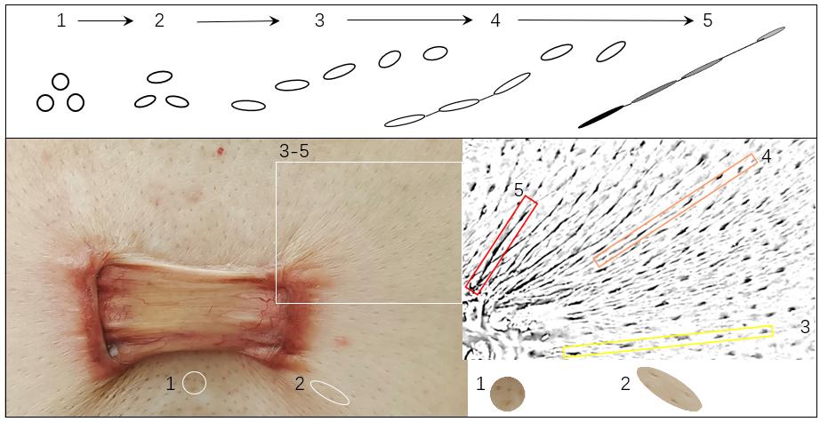
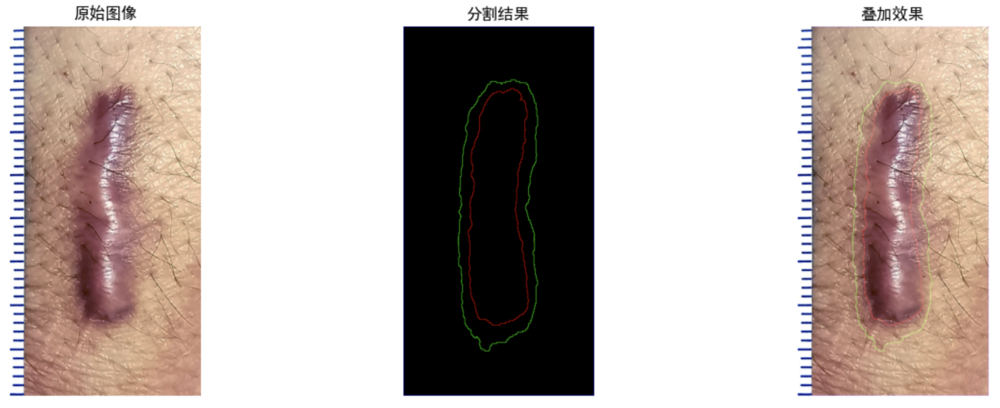

# 瘢痕疙瘩皮纹分析系统（KeTAS）文档中文翻译

> 说明：以下内容依据原文完整翻译并整理为 Markdown 格式。原文中的占位符（如 `xxx`、`xxxx`、`Fig. XX`）、内部修改备注和暂未补充的引文提示均予以保留；图像按原文顺序插入。

## 引言

瘢痕疙瘩是典型的皮肤病理性瘢痕，可视为连接软组织纤维化与肿瘤的枢纽[^1]。一方面，瘢痕疙瘩在真皮网状层内表现出结缔组织过度沉积的组织学特征，因此被归入纤维化疾病[^2]；另一方面，其具有类似肿瘤的生物学行为，例如终生持续、具有攻击性地侵入初始损伤或感染范围以外的邻近健康皮肤，以及治疗后频繁复发，这使瘢痕疙瘩成为最严重的一类纤维增生性疾病[^1]。它与癌症的主要区别仅在于不存在细胞异型性和内源性转移。

具体而言，瘢痕疙瘩的侵袭与局部力学环境密切相关。相关证据既来自对力学生物学机制的基础研究，例如力学响应基因天冬氨酸蛋白聚糖（asporin）[^3]和 Wnt/β-catenin 力学信号通路[^4]，也来自一系列减张力学治疗策略的临床有效性验证[^5]，例如最小张力切口设计[^6]和方形皮瓣手术[^7]。因此，追踪瘢痕疙瘩的动态变化，并据此揭示其在真实体内力学情境下发生局部侵袭的规律，将同时有益于纤维化和肿瘤研究领域。

迄今为止，瘢痕疙瘩的病因仍不明确，治疗效果也较为有限。因此，临床上迫切需要对其发生、复发和进展进行早期诊断，并建立早期、敏感、准确、可重复且无创的局部诊断指标。遗憾的是，目前针对瘢痕疙瘩发生过程的评估仍局限于缺乏明确聚焦点的综合性方法，例如：

1. 对瘢痕疙瘩大小、形状和红斑程度进行静态形态学分级；
2. 使用不同量表对主观症状进行评分[^8]，例如温哥华瘢痕量表（Vancouver Scar Scale，VSS）、患者与观察者瘢痕评估量表（Patient and Observer Scar Assessment Scale，POSAS）以及日本瘢痕研讨会（Japan Scar Workshop，JSW）瘢痕量表（JSS）[^9]。

这些评估结果通常只能通过术后组织学报告加以验证，难以满足瘢痕疙瘩终生侵袭过程中的临床需求。具体而言，其他疾病模型中常用的、聚焦于剂量—效应关系和阈值评估的传统定量诊断方法，很难直接应用于瘢痕疙瘩发生过程，因为瘢痕疙瘩缺乏明确、可操作的疾病分级和分期体系。

真正的困难在于：瘢痕疙瘩发生过程中，其局部侵袭在皮肤表面仅引起极其细微的外显变化，而传统评估手段难以及时捕捉这些变化，包括全身血液采样、深部影像学检查、较粗略的浅表软组织超声检查，以及滞后的组织学检测。因此，亟须从现有临床证据出发，从零构建一种新的诊断系统，并形成精细的早期诊断指标，从而以无创、敏感、动态、实时、个体化且可自验证的方式监测和分析瘢痕疙瘩的局部侵袭。

根据动态临床观察，我们注意到，在牵拉逐步驱动瘢痕疙瘩生长的过程中，瘢痕疙瘩周围的皮肤表面纹理由最初不明显逐渐发展为完全显现，如图 1 所示。简而言之，在慢性机械刺激作用下，瘢痕疙瘩持续侵入邻近健康皮肤时，单个毛囊的形态会由圆形逐渐变为梭形。随后，这些点状、变形的毛囊在视觉上呈虚线样排列，但彼此实际上仍相互分离。随着皮肤纹理逐渐隆起，毛囊开始选择性地与相邻毛囊形成边界连接，最终皮纹可由肉眼清晰辨认；此时，皮纹沿机械刺激方向穿过梭形毛囊的长轴。

基于这种瘢痕疙瘩特异性的皮纹动态演化现象，我们提出如下假设：若能够对复杂皮纹进行动态、客观评估，则可在人工智能（AI）的辅助下，反映瘢痕疙瘩发生的存在、范围和程度，甚至预测瘢痕疙瘩的侵袭方向。

**图 1. 瘢痕疙瘩发生过程中捕捉到的皮纹动态形成过程**

在瘢痕疙瘩持续侵入邻近健康皮肤的过程中，侵袭边缘周围伴随皮纹逐渐出现的动态过程。作为对局部机械牵拉的响应，单个毛囊的形状由圆形（1）变为梭形（2）。随后，原本规则的点状毛囊网格逐渐演变为虚线样排列（3），尽管各个梭形毛囊之间仍彼此分离。进一步地，随着梭形毛囊不断拉长、变扁，在隆起皮纹的帮助下，其开始选择性地与相邻毛囊形成边界连接（4）。最终，当逐渐加深、增粗的皮纹能够被肉眼追踪，并沿机械刺激方向穿过各梭形毛囊的长轴、将相邻毛囊连接起来时，完整皮纹即形成（5）。

近年来，“人工智能赋能医学”在靶向、精准评估方面取得了显著进展。医学分割大模型 MedSAM 推动了医学图像分割的发展，并已用于皮肤癌局部分析（UWSkinCancerMSBench）、CT 数据局部标注（*AbdomenAtlas-8K: Annotating 8,000 CT Volumes for Multi-Organ Segmentation in Three Weeks，NeurIPS 2023*）以及三维病理样本的局部分析[^10]。多模态专家混合大模型（Mixture of Modality Experts，MOME）也在基于 MRI 的乳腺癌局部分析中显示出良好前景[^11]。与传统方法相比，这些 AI 技术提供了无创、客观且准确的替代方案，为探索直观、易获取的瘢痕疙瘩皮肤表面特征，以及构建面向瘢痕疙瘩侵袭评估的定制模型奠定了基础。

本文提出一种评估指标，通过 AI 驱动的局部皮肤纹理结构分析，捕捉瘢痕疙瘩发生过程中明确的局部形态学指标，从而指示瘢痕疙瘩侵袭是否存在、侵袭范围、侵袭程度，甚至侵袭方向。该方法所能提供的信息远超临床上依据已经外显的红色侵袭边缘处瘙痒或疼痛所作的常规判断。

首先，使用高清相机采集瘢痕疙瘩图像，以获得高分辨率皮纹特征。其次，基于 AI 分割基础模型，对瘢痕疙瘩周缘及其邻近皮肤进行分割。第三，在分割区域内对皮肤纹理结构进行 Gabor—梯度域分析，计算一种新的瘢痕疙瘩指数（Ke-index，以下简称“Ke 指数”）。Ke 指数包含三个临床诊断指标（clinical diagnostic indicators，CDIs），分别量化瘢痕疙瘩侵袭的存在性、严重程度和方向。

因此，Ke 指数能够帮助临床医生判断是否存在瘢痕疙瘩侵袭，以支持诊断；评估其侵袭范围和程度，以支持治疗决策；并进一步预测侵袭方向，以指导预防性干预。所提出的 Ke 指数及其指标满足临床对瘢痕疙瘩发生过程进行无创、敏感、动态、实时、个体化和可自验证评估的需求。同时，该方法也可为纤维化和肿瘤领域提供参考，用于将其疾病进展过程数字化，而瘢痕疙瘩可作为其中一个先验范例。

## 结果

### 皮肤纹理结构与瘢痕疙瘩侵袭之间的关联

基于第一手临床证据，并在具有丰富瘢痕疙瘩诊疗经验的临床医生协助下，我们发现皮肤纹理结构与瘢痕疙瘩侵袭之间存在关联。瘢痕疙瘩发生局部侵袭时，其周缘皮纹可呈现以下临床信息：

1. 皮纹跨越瘢痕疙瘩侵袭周缘的红色区域与邻近正常皮肤之间的边界，同时覆盖两侧区域（图 3a）。我们将该区域命名为“潮间带”（Intertidal Zone，IZ）。
2. 原本平行排列的皮纹可能受到挤压，形成向瘢痕疙瘩中心聚拢的同心圆结构；也可能向外呈放射状排列并延伸至邻近健康皮肤（图 3）。后者提示侵袭活动更为活跃（图 3b）。
3. 放射状排列的皮纹常见于侵袭前沿，其方向与局部机械刺激方向以及瘢痕疙瘩典型的部位相关形态一致，例如胸部的“蝴蝶形”瘢痕疙瘩（图 1b）。
4. 作为对慢性局部力学刺激的动态响应，皮纹形态的即时变化早于组织学结构改变。因此，它可能将“功能性的机械刺激”与“可见的组织肿块形成”之间缺失的中间环节外显出来。

### KeTAS

我们开发了一套由 AI 驱动、用于预测瘢痕疙瘩侵袭的统计分析系统，命名为瘢痕疙瘩皮纹分析系统（Keloid Textural Analysis System，KeTAS）（图 2）。该系统由三个核心模块组成：

1. 图像采集模块，用于捕捉高分辨率、细节丰富的皮肤表面纹理；
2. 图像分割模块，用于区分潮间带、正常皮肤区和瘢痕疙瘩主体区；
3. Gabor—梯度特征分析模块，在分割得到的潮间带内进行分析，从而准确、可泛化且可靠地预测瘢痕疙瘩侵袭。

与其他 AI 方法相比，KeTAS 在可解释性、避免“幻觉”、泛化能力和鲁棒性方面具有明显优势。该框架将整体分析拆分为两个部分：由大规模分割模型完成图像分割，由特征工程完成 Gabor—梯度特征分析，从而有效结合两种范式的互补优势。

这一策略一方面能够获得较强的泛化能力和鲁棒性，同时缓解纯 AI 方法中的关键局限，例如结果“幻觉”和可解释性不足；另一方面，又能产生高度可解释、无“幻觉”的分析结果，同时克服纯特征分析方法难以有效利用大规模标注数据中所编码知识的缺点。

值得注意的是，KeTAS 能够综合评估瘢痕疙瘩侵袭的存在性、分布、严重程度和方向，其信息量远高于现有常规临床评估。更重要的是，KeTAS 使得以无创、敏感、动态、实时、个体化和可自验证的方式量化瘢痕疙瘩侵袭的存在性、方向和严重程度成为可能。

因此，KeTAS 有望辅助临床医生识别瘢痕疙瘩侵袭，实现早期诊断；评估其空间范围和程度，为治疗规划提供依据；并进一步预测侵袭方向，以指导预防性干预。

**图 2. KeTAS 流程**

该流程包括数据采集、数据标注和数据处理，其中数据处理包括分割以及 Gabor—梯度域分析。系统可获得一种新的潮间带指数，以及反映瘢痕疙瘩侵袭存在性、方向和严重程度的三个指标。`2026`

### Ke 指数及三个指标

使用 KeTAS 可获得 Ke 指数，其中包含以下三个医学诊断指标：

1. **指标 1：瘢痕疙瘩侵袭存在性指标。** 用于判断瘢痕疙瘩是否正在生长，由是否存在潮间带（IZ）推导得到。

   > 原文备注：例如 xxx 示例图，需要运行一次 seg，得到 0–1 mask map `(h, w, 1)`，计算每个区域的 presence。

2. **指标 2：瘢痕疙瘩侵袭严重程度指标。** 由潮间带面积与瘢痕疙瘩总面积之比推导得到；整个瘢痕疙瘩病灶的总面积同样由 KeTAS 分割获得。

   > 原文备注：例如 xxx，八个区域的活跃度。

3. **指标 3：瘢痕疙瘩侵袭方向指标。** 由 KeTAS 在分割潮间带内进行纹理方向分析后得到。

   > 原文备注：例如 xxx。

**图 3. KeTAS 的验证**

> 原文备注：结合新的图和 seg/direction 结果描述。

### 验证

在动态临床观察和评估过程中，上述指标的敏感性、准确性和可重复性均得到了反复验证。

1. **敏感性。** 动态皮纹对局部运动高度敏感、响应迅速，尽管早期变化可能不稳定，但在足够长时间的重复机械作用下，这些变化可固化为静态皮纹，并以稳定信号的形式外显。系统可在这些早期信号刚刚出现时将其捕捉，此时传统且滞后的组织学证据尚未形成明确表现。
2. **有效性。** 除标准观察期外，我们还针对每位患者，从侵袭是否存在、严重程度和方向三个角度，将瘢痕疙瘩侵袭评估额外延长 6 个月。通过动态呈现和验证皮纹对局部侵袭的评估结果，以确保评估准确性。
3. **可重复性。** 对于所有患者，无论其偏好并最终选择何种治疗策略，包括药物姑息治疗，或手术切除后接受放射治疗（见相关图示），均按照第 2 点所述方式对瘢痕疙瘩的进展、侵袭或复发进行交叉验证。在当前研究能力范围内，这有助于保证不同病变部位、不同病程，以及不同患者个体、性别和年龄之间评估的一致性。
4. **可靠性。** 本系统在图像采集过程中对相机、镜头等专业成像硬件的依赖较低。此外，在图像识别过程中，毛发、皮肤碎屑和局部药物残留等非皮纹混杂因素造成的局部干扰较小。通过有意识地获得较高的信噪比，可进一步增强后续皮纹评估的可靠性。

## 讨论

> 原文结构备注：结果部分包括：1）KeTAS 自动进行皮纹—瘢痕疙瘩分析；2）临床发现皮纹—瘢痕疙瘩关联；3）潮间带指数和三个指标。

### 1. AI 与 Gabor—梯度域分析相结合的意义

KeTAS 提出了一种将人工智能（AI）与传统 Gabor—梯度域视觉纹理分析相结合的混合策略，可有效解决当前主流方法的固有缺陷。`【加文献】`

尽管现有医学诊断领域中的纯大模型方案已经取得了显著进展，但仍存在训练难度高、结果容易出现“幻觉”、可靠性不足等问题。相比之下，传统视觉分析方法具有更强的可解释性和稳定性，但难以充分利用大数据和大模型中蕴含的知识优势，在挖掘疾病特异性特征方面的能力也较为有限。

本研究通过任务解耦实现优势互补。对于潮间带分割这一标准分类任务，其需要大量关于瘢痕疙瘩形态的先验知识，因此采用已在类似医学分割任务中得到充分验证的 MedSAM 模型，并使用我们经精细人工标注的瘢痕疙瘩分割数据进行微调，使其适配本文任务。对于纹理方向分析这一非标准任务，由于难以获得大规模监督数据，因此采用传统的 Gabor—梯度域视觉分析方法，并人工设计纹理方向特征，以获得准确且无“幻觉”的结果输出。

这种任务解耦策略不仅充分发挥了预训练大模型的优势，以及现有人工标注瘢痕疙瘩数据的价值，还有效规避了纯大模型方案带来的不可靠性问题，为瘢痕疙瘩诊断提供了更优解决方案。

### 2. 客观定量诊断的意义

长期以来，瘢痕疙瘩诊断主要依赖主观临床评估；即使少数看似客观的指标，也高度依赖医生经验，导致不同医疗机构和不同医生之间的诊断结果存在显著差异，严重制约了该领域的标准化发展。

本研究开发的 KeTAS 及其标准化分析方法显著降低了诊断对主观判断的依赖，实现跨机构、跨医生的一致性诊断，为瘢痕疙瘩诊断标准化提供关键技术路径，并为该疾病诊疗的大规模推广、成本控制和效率提升提供有力支持。

### 3. 皮纹与瘢痕疙瘩侵袭高度相关的意义

本研究的一项核心发现是，皮纹形态与瘢痕疙瘩侵袭之间存在高度相关性，而这一现象此前尚未在该领域得到报道。该发现不仅为评估瘢痕疙瘩侵袭程度，包括侵袭强度和方向，提供了一种新的定量工具，也为分析该疾病的发病机制提供了重要线索，为探索疾病发生和发展的内在规律开辟了新方向。

### 4. 有效临床自验证的意义

临床动态自验证结果表明，新发现的潮间带 Ke 指数，以及瘢痕疙瘩发生的存在性、严重程度和方向三个指标具有良好有效性。这不仅验证了本研究所提出技术方案的可靠性，也充分证明了整个流程的科学性、准确性和效率，包括数据采集、处理、分析，以及指数和指标的计算。

此外，本研究提出了用于预测瘢痕疙瘩慢性侵袭过程程度和方向的新指标，为后续临床转化奠定了坚实基础。

### 5. 为什么观察皮纹，而不是更早期的单个毛囊

> 原文标题备注：充分性 + 必要性 + 最早可识别。

本研究评估的是瘢痕疙瘩发生过程中皮纹的动态变化，而不是更早出现变化的单个毛囊，原因如下：

1. 在力学依赖的皮纹形成过程中，只有当皮纹完整出现后，才能判断哪些毛囊受到的影响最大。此时，这些毛囊的梭形形态已经稳定，其长轴依次被检测到的皮纹穿过。
2. 连续、固定的皮纹能够被肉眼识别，也能通过拍摄图像加以区分；而整个视野内呈网格状、轻微变形且彼此分隔的不稳定毛囊，更多构成干扰因素，而非有效信息来源。
3. 只有完全形成并聚集成簇的皮纹，才能通过不同分布模式共同提供具有信息价值的特征（图 5）。随着瘢痕疙瘩病程延长，皮纹会变得更粗、更长、更典型，从而更有利于临床决策。

例如，瘢痕疙瘩边缘皮纹呈同心圆分布时，其侵袭程度低于呈放射状排列、正在选择侵袭方向的情况。只有当平行排列的皮纹形成后，才能真正识别红色瘢痕疙瘩组织沿既定方向向内生长；这一侵袭方向由皮纹整体平行排列所共同指示。

**图 5. 可识别的聚集皮纹可通过其分布模式提供与侵袭相关的信息**

可识别皮纹是瘢痕疙瘩局部侵袭过程中，对慢性机械刺激产生的动态、响应性反应。因此，皮纹的即时变化先于组织学结构结果。最初，瘢痕疙瘩边缘皮纹呈同心圆分布（①）时，其侵袭程度低于皮纹呈放射状排列（②）、正在选择侵袭方向的状态。只有当平行排列的皮纹（③）形成后，才能识别红色瘢痕疙瘩组织真正向内生长，其既定侵袭方向由皮纹整体平行排列所指示。

相应地，瘢痕疙瘩会沿皮纹所指示的方向轨迹生长。图中红色、橙色和粉色方框内的区域逐步发生变化，并最终形成更多瘢痕疙瘩组织。这一过程可能将瘢痕疙瘩发生过程中“功能性的机械刺激”与“可见的组织肿块形成”之间缺失的中间环节外显出来。

### 讨论部分需要补充的关键说明

#### 1. 缺乏金标准时的自验证

尽管难以采用动态组织学验证作为金标准，与 KeTAS 结果逐一匹配，但静态和动态自验证均表明，本系统的结果可信且有效。

在静态层面，潮间带内部的存在性、严重程度和方向三个指标由 KeTAS 分别自动推导，并可通过三者之间的交叉验证形成闭环，在持续更新中逐步修正和完善。在潮间带以外，系统预测的未来侵袭方向还可由邻近健康皮肤中梭形毛囊的长轴方向加以印证；尽管这一旁证的敏感性可能高于特异性，但仍可作为辅助证据。

在动态层面，随着持续观察，三个指标均可获得直接事实证据加以确认，即瘢痕疙瘩后续真实侵袭方向确实遵循 KeTAS 先前所指示的方向。指定区域和方向上的瘢痕疙瘩肿块肉眼可见地增大并出现水肿，也进一步支持了这一持续性行为。

#### 2. 为什么能够进行动态观察、获得足量图像，而不牺牲患者利益

皮纹的临床观察可在日常标准化瘢痕疙瘩管理过程中完成，例如外用药物治疗、激光治疗、糖皮质激素注射，或手术后放射治疗。具体治疗方式根据患者偏好和治疗可行性选择，目标始终是最大程度地使患者获益。

考虑到瘢痕疙瘩可能由轻微毛囊炎引起，也可能在创伤或手术后形成，且术后复发频繁，KeTAS 尤其适用于以下患者：

1. 偏好保守治疗者，尤其是具有家族史者；
2. 患有难治性瘢痕疙瘩并经历多次术后复发者；
3. 存在多发、扩散性且持续出现新病灶者。

### 6. 本研究未来的扩展应用

本研究提出的 KeTAS 为瘢痕疙瘩皮纹分析和诊断标准化提供了一种可行方案，具有显著的潜在应用价值。预计其可成为瘢痕疙瘩诊断、治疗和预防等临床实践中的常规客观评估工具，具有无创、敏感、动态、实时、个体化和可自验证等特征，这与引言中“以无创、敏感、动态、实时、定制化和可自验证方式进行评估”的定位一致，其标准化地位可类比血液检查中的血小板检测。

将 KeTAS 系统及其包含三个指标的 Ke 指数推广至各级医疗机构，可实现瘢痕疙瘩诊断流程的统一化和标准化，为广大患者提供可信、高质量的诊断依据，构建低成本、高效率的瘢痕疙瘩诊断社会医疗基础，并推动该疾病诊疗体系的升级和完善。

基于皮纹的瘢痕疙瘩特异性 KeTAS 系统具有以下特征：

1. **功能的形态学外显。** 瘢痕疙瘩是一种对机械力敏感并产生响应的疾病，表现出依赖牵拉的侵袭行为。机械刺激主要包括深部骨骼肌收缩，同时也包括具有固定节律和频率的心跳与呼吸。这些复杂运动功能很难分别监测，更难整合为具有意义的整体。幸运的是，这些功能变化可以通过浅表皮纹进行追踪，并由 KeTAS 以形态学表现加以解析。
2. **动态侵袭的静态外显。** 类肿瘤样持续侵袭是瘢痕疙瘩作为良性纤维化疾病的标志性特征。此类动态过程的存在性、分布、严重程度和方向，可以通过周期性采集的静态图像加以整体捕捉，并反映为皮纹密度、深度、厚度和方向的变化。
3. **高度分化特征的可量化外显。** 传统方法通常通过定性或半定量问卷主观评估瘢痕疙瘩严重程度，而可识别、可追踪的皮纹则能通过 KeTAS 提供客观信息。
4. **早期捕捉侵袭信息。** 瘢痕疙瘩发生的传统金标准，是病理医生在手术切除后通过显微镜观察到玻璃样变胶原纤维。仅依靠这种滞后的组织学发现进行诊断为时已晚，也远不能满足无创诊断、非侵入性干预，以及在真实生长发生前进行早期预测的实际需求；KeTAS 可为这些需求提供完整解决方案。

此外，KeTAS 提供了一种以静态皮纹作为疾病进展早期诊断系统的范式，将定性信息（是否启动侵袭）、定量信息（严重程度）和方向信息整合起来，同时覆盖疾病全病程和不同治疗策略。该系统不仅可用于疾病诊断，还可指导医生和患者选择预防性操作，并调整治疗策略。

随着 AI 技术进步，KeTAS 在人体最大且最表浅器官——皮肤——中的瘢痕疙瘩发生过程上取得成功应用，提示其未来有望扩展至其他慢性疾病和具有条纹样外观的器官病变，例如纤维化或肿瘤。在这些疾病中，瘢痕疙瘩不仅可通过侵袭行为，还可通过形态学指标发挥连接枢纽的作用。

事实上，瘢痕疙瘩特异性皮纹在瘢痕力学生物学基础研究与瘢痕力学治疗实际应用之间建立了典型联系。通过动态评估瘢痕疙瘩周围皮纹对局部力学环境的响应，KeTAS 可以：

1. 为诊断、治疗和预防性干预的临床决策提供充分信息，从根本上升级病理性瘢痕的诊疗策略；
2. 为纤维化和肿瘤研究提供可借鉴的典型示范。

瘢痕疙瘩是表现出类肿瘤特征的典型真皮纤维化疾病。只要能够在瘢痕疙瘩发生过程中监测并评估其持续侵袭，KeTAS 系统就可被借鉴至纤维形成和肿瘤发生研究，从而催生更多有价值的发现和应用。

## 4. 方法

本研究共纳入 `xxx` 名成年门诊患者，其瘢痕疙瘩位于胸部、肩胛区或腹部，并于 `xxxx` 年至 `xxxx` 年期间在北京清华长庚医院接受临床治疗。每次随访均进行标准化微距摄影，以动态记录瘢痕疙瘩及其周围皮纹的变化。患者数量、研究起止时间、伦理审批编号和知情同意程序应在定稿时根据真实研究记录补充，不应保留占位符。

基于临床观察到的皮纹结构与瘢痕疙瘩侵袭进展之间的相关性，我们构建瘢痕疙瘩皮纹分析系统（Keloid Texture Analysis System，KeTAS）。系统由三个模块组成：标准化图像采集、基于 U-Net 的三分类语义分割，以及 Gabor—梯度域纹理分析。系统输出严重度图、存在性图和方向图，分别用于描述单幅图像内潮间带纹理异常的相对强度、空间分布和候选传播方向。

本流程采用任务解耦设计。首先，利用人工标注训练 U-Net，将图像分为正常皮肤区、潮间带和瘢痕疙瘩主体区；随后，仅在经后处理得到的有效潮间带内使用传统计算机视觉方法提取纹理、估计局部纹理轴并计算区域级指标。由于严重度分数在每幅图像内独立归一化，其数值首先应解释为图内相对指标，而非未经校准即可跨患者比较的绝对临床量。

### 4.1 瘢痕疙瘩图像采集

拍摄时将目标瘢痕疙瘩及其周围皮肤置于图像中央，使用高清微距摄影记录皮纹细节。为保证像素尺度参数和纵向比较的可解释性，正式研究方案还应固定并报告相机与镜头型号、拍摄距离、图像分辨率、光源与色温、拍摄角度、白平衡、皮肤牵拉状态及物理比例尺。若这些条件未被统一，则本文所用的像素半径只能视为图像尺度参数，不能直接换算为统一的物理距离。

**图 5. 使用 U-Net 模型进行三分类分割的示例结果**

绿色曲线以外为正常皮肤区，绿色曲线与红色曲线之间为潮间带，红色曲线以内为瘢痕疙瘩主体区。

### 4.2 瘢痕疙瘩区域分割

#### 4.2.1 标注与类别定义

输入图像被划分为三个互斥类别：类别 0 为正常皮肤区，类别 1 为潮间带（标注字段 `KELOID_BOUNDARY`），类别 2 为瘢痕疙瘩主体区（标注字段 `KELOID_BODY`）。在临床医生协助下，使用多边形对类别 1 和类别 2 进行标注；未被上述多边形覆盖的像素归为类别 0。类别 2 在标签生成时覆盖其与类别 1 重叠的像素。

#### 4.2.2 U-Net结构与训练

本研究采用标准 U-Net[^12]。输入 RGB 图像被双线性缩放至 $256\times256$ 像素。编码器包含五级双卷积模块，输出通道数依次为 64、128、256、512 和 1024。每个双卷积模块由两组 $3\times3$ 卷积、批归一化和 ReLU 激活组成。编码器使用 $2\times2$ 最大池化下采样；解码器使用核大小和步长均为 2 的转置卷积上采样，并与对应编码层特征进行跳跃连接。最后使用 $1\times1$ 卷积输出三个类别的 logits。

设模型输出为 $z_{p,c}$，其中 $p$ 表示像素，$c\in\{0,1,2\}$ 表示类别。像素级类别概率和预测标签分别为：

$$
P_{p,c}=\frac{\exp(z_{p,c})}{\sum_{r=0}^{2}\exp(z_{p,r})},
\qquad
\widehat y_p=\arg\max_c P_{p,c}.
\tag{1}
$$

训练采用多类别交叉熵损失：

$$
\mathcal L_{\mathrm{CE}}
=-\frac{1}{|\mathcal P|}
\sum_{p\in\mathcal P}\log P_{p,y_p},
\tag{2}
$$

其中，$\mathcal P$ 为训练图像中的像素集合，$y_p$ 为真实类别。优化器为 Adam，学习率为 0.001，批大小为 8，最大训练轮数为 100。数据按 80% 和 20% 划分训练集与验证集，随机种子为 42。训练集可使用亮度、对比度、饱和度和色相扰动，验证集不做颜色增强。以验证集损失作为早停依据，patience 设为 20。

推理时将预测标签图以最近邻插值恢复至原始图像尺寸。下游潮间带分析使用类别 1 掩膜，瘢痕主体的空间锚点由类别 2 掩膜确定。

#### 4.2.3 有效潮间带后处理

设 U-Net 输出的类别 1 二值掩膜为 $M_0$，图像高度为 $H$。为得到纹理分析使用的有效潮间带，依次执行：

$$
M_c=\operatorname{Close}(M_0,E_5),
\tag{3}
$$

$$
M_e=\operatorname{Dilate}
\left(M_c,E_{2\lfloor H/30\rfloor+1}\right),
\tag{4}
$$

$$
M=\operatorname{LCC}_8\!\left[
\operatorname{Erode}
\left(M_e,E_{2\max(1,\lfloor H/80\rfloor)+1}\right)
\right],
\tag{5}
$$

其中，$E_k$ 表示大小为 $k\times k$ 的椭圆结构元，$\operatorname{LCC}_8$ 表示仅保留面积最大的 8 连通分量。$M_e$ 用于限制 Gabor 分析的初始感兴趣区域，最终有效掩膜 $M$ 用于限制纹理线、严重度和方向计算。该后处理意味着下游分析区域并非未经处理的原始类别 1 预测。

### 4.3 Gabor—梯度域皮纹分析

#### 4.3.1 Gabor纹理提取

设原始 RGB 图像为 $I$。首先使用扩张后的潮间带掩膜构造感兴趣图像：

$$
I_{\mathrm{ROI}}(p)=I(p)M_e(p).
\tag{6}
$$

本研究使用 4 个方向和 2 个波长：

$$
\Theta=\left\{0,\frac{\pi}{4},\frac{\pi}{2},\frac{3\pi}{4}\right\},
\qquad
\Lambda=\{10,15\}\ \text{pixels},
\tag{7}
$$

因此滤波器组共包含 $4\times2=8$ 个 Gabor 核，而不是 12 个。对局部坐标 $(x,y)$，定义旋转坐标：

$$
x'=x\cos\theta+y\sin\theta,
\qquad
y'=-x\sin\theta+y\cos\theta.
\tag{8}
$$

实值 Gabor 核为：

$$
g_{\theta,\lambda}(x,y)=
\exp\!\left[-\frac{x'^2+\gamma^2y'^2}{2\sigma_g^2}\right]
\cos\!\left(2\pi\frac{x'}{\lambda}+\psi\right),
\tag{9}
$$

其中，卷积核大小为 $9\times9$，$\sigma_g=3.0$，$\gamma=0.5$，$\psi=0$。实现中将每个核除以 $1.5\sum_{x,y}g_{\theta,\lambda}(x,y)$ 后执行卷积。各滤波响应转换为灰度后线性相加，并进行 Min-Max 归一化至 $[0,255]$：

$$
F_A=255\,
\frac{F_\Sigma-\min(F_\Sigma)}
{\max(F_\Sigma)-\min(F_\Sigma)},
\qquad
F_\Sigma=\sum_{\theta\in\Theta}
\sum_{\lambda\in\Lambda}
\operatorname{Gray}(I_{\mathrm{ROI}}*g_{\theta,\lambda}).
\tag{10}
$$

若 $\max(F_\Sigma)=\min(F_\Sigma)$，应将归一化结果置零以避免除零。

随后使用 OpenCV 高斯自适应阈值进行二值化，邻域大小为 $11\times11$，常数 $C=2$：

$$
F_B(p)=
\begin{cases}
255, & F_A(p)>\mu_G^{11\times11}(p)-2,\\
0, & \text{otherwise},
\end{cases}
\tag{11}
$$

其中，$\mu_G^{11\times11}(p)$ 为像素 $p$ 周围高斯加权局部均值。再使用低、高阈值分别为 50 和 150 的 Canny 算子提取边缘，并使用 $3\times3$ 全 1 结构元膨胀一次：

$$
F=\operatorname{Dilate}
\left(\operatorname{Canny}(F_B;50,150),\mathbf 1_{3\times3}\right)\odot M,
\tag{12}
$$

其中，$\odot$ 表示逐像素乘法。$F$ 是保持原图尺寸、像素值严格为 0 或 255 的单通道纹理线图，使用无损 PNG 直接保存，不经过 Matplotlib 画布、抗锯齿或尺寸重采样。

**图 6. 使用 Gabor、自适应阈值和 Canny 提取潮间带纹理线的示例结果**

#### 4.3.2 结构张量与像素级纹理轴

在单通道纹理线图 $F$ 上使用 Scharr 算子计算横向和纵向梯度：

$$
G_x=\operatorname{Scharr}_x(F),
\qquad
G_y=\operatorname{Scharr}_y(F).
\tag{13}
$$

仅保留有效潮间带 $M$ 内的梯度。定义：

$$
J_{11}=G_{\sigma_s}*(G_x^2),
\qquad
J_{22}=G_{\sigma_s}*(G_y^2),
\qquad
J_{12}=G_{\sigma_s}*(G_xG_y),
\tag{14}
$$

其中，$G_{\sigma_s}$ 为二维高斯核：

$$
G_{\sigma_s}(p,q)\propto
\exp\!\left(-\frac{\|p-q\|_2^2}{2\sigma_s^2}\right),
\qquad
\sigma_s=\max\!\left(3,
\left\lfloor\frac{\min(H,W)}{100}\right\rfloor\right),
\tag{15}
$$

高斯核边长为 $6\sigma_s+1$。像素 $p$ 的结构张量为：

$$
J(p)=
\begin{bmatrix}
J_{11}(p)&J_{12}(p)\\
J_{12}(p)&J_{22}(p)
\end{bmatrix}
=V(p)
\begin{bmatrix}
\lambda_1(p)&0\\
0&\lambda_2(p)
\end{bmatrix}
V(p)^{\mathrm T},
\quad \lambda_1\geq\lambda_2.
\tag{16}
$$

定义结构张量能量 $E(p)=\lambda_1(p)+\lambda_2(p)$，并令
$E_{\mathrm{th}}=\max[\epsilon_{32},10^{-6}\max_{q\in M}E(q)]$，其中
$\epsilon_{32}$ 为 32 位浮点数的机器精度。仅对满足 $M(p)=1$ 且
$E(p)>E_{\mathrm{th}}$ 的像素保留方向，其余位置记为无效方向。

最大特征值 $\lambda_1$ 对应的单位特征向量 $v_1$ 表示局部灰度变化最强方向，即纹理线的法向，而不是纹理线自身的走向。因此，纹理切向量和无向纹理角定义为：

$$
t(p)=
\begin{bmatrix}0&-1\\1&0\end{bmatrix}v_1(p),
\qquad
\theta(p)=\operatorname{atan2}(t_y(p),t_x(p))\bmod\pi.
\tag{17}
$$

式（17）中的 $90^\circ$ 旋转是必要步骤。直接将 $v_1$ 称为纹理方向会把纹理法向误写为纹理走向。上述能量约束用于排除平坦区域中由零结构张量产生的任意特征向量。

**图 7. 基于结构张量得到的纹理方向估计及八扇区分析示例**

附加的八扇区可视化将图像按相对于图像中心的极角划分为 8 个 $45^\circ$ 扇区。每个扇区统计纹理密度和方向集中程度，用于辅助展示整体空间分布；像素级严重度图和 Worst Area 提取并不依赖必须选出一个扇区。

### 4.4 定量指标计算

#### 4.4.1 局部纹理密度

由于 $F$ 已是未经重采样的 0/255 二值纹理线图，非零像素直接定义为纹理点，不再使用额外的经验阈值：

$$
T(p)=\mathbb I[F(p)>0]M(p).
\tag{18}
$$

局部统计使用半径为 $r$ 的圆盘核，而非方形全 1 核：

$$
K_r(u,v)=\mathbb I[u^2+v^2\leq r^2].
\tag{19}
$$

当未指定固定半径时，半径按图像短边动态确定：

$$
r=\operatorname{clip}\!\left(
\operatorname{round}\left[80\frac{\min(H,W)}{920}\right],
12,96
\right).
\tag{20}
$$

局部纹理密度为：

$$
D_s(p)=
\frac{(T*K_r)(p)}{(M*K_r)(p)},
\qquad (M*K_r)(p)>0.
\tag{21}
$$

分母为零时令 $D_s(p)=0$。分析程序也允许使用固定半径替代式（20）。

#### 4.4.2 局部方向一致性

纹理方向是周期为 $\pi$ 的无向轴。设方向有效指示图为 $V(p)=\mathbb I[\theta(p)\ \text{is valid}]M(p)$。使用双角向量消除 $0^\circ$ 与 $180^\circ$ 的边界不连续：

$$
C_2(p)=\cos[2\theta(p)]V(p),
\qquad
S_2(p)=\sin[2\theta(p)]V(p).
\tag{22}
$$

在圆盘邻域内计算：

$$
\bar C_2(p)=\frac{(C_2*K_r)(p)}{(V*K_r)(p)},
\qquad
\bar S_2(p)=\frac{(S_2*K_r)(p)}{(V*K_r)(p)},
\tag{23}
$$

$$
D_c(p)=\sqrt{\bar C_2(p)^2+\bar S_2(p)^2},
\qquad (V*K_r)(p)>0.
\tag{24}
$$

$D_c\in[0,1]$；越接近 1 表示邻域内纹理轴越集中，越接近 0 表示方向越分散。分母是通过结构张量能量约束的方向有效像素数，而不是固定窗口面积。

需要强调的是，$D_c$ 衡量的是纹理方向的集中程度，而不是平均纹理方向本身。将式（23）的两个分量写成复数形式，有

$$
\bar R_2(p)=\bar C_2(p)+\mathrm{i}\bar S_2(p)
=\frac{1}{N_p}\sum_{q\in B_r(p)}V(q)\exp[\mathrm{i}2\theta(q)],
\tag{24a}
$$

其中 $N_p=(V*K_r)(p)$。若邻域内所有纹理轴整体旋转相同角度 $\alpha$，即 $\theta'(q)=\theta(q)+\alpha$，则

$$
\bar R'_2(p)=\exp(\mathrm{i}2\alpha)\bar R_2(p).
\tag{24b}
$$

因 $\lvert\exp(\mathrm{i}2\alpha)\rvert=1$，所以

$$
D'_c(p)=\lvert\bar R'_2(p)\rvert
=\lvert\bar R_2(p)\rvert
=D_c(p).
\tag{24c}
$$

因此，纹理整体由例如 $45^\circ$ 旋转至 $90^\circ$ 时，只要各方向相对于其平均方向的离散程度不变，$D_c$ 就保持不变。平均纹理轴由

$$
\bar\theta(p)=\frac{1}{2}\operatorname{atan2}\!\left(\bar S_2(p),\bar C_2(p)\right)\pmod{\pi}
\tag{24d}
$$

单独给出；整体旋转会使 $\bar\theta$ 改变 $\alpha$，但不会改变 $D_c$。这种分离使平均方向负责描述“纹理朝哪个轴向排列”，而一致性负责描述“纹理围绕该轴向排列得多集中”。因此，平均方向的绝对角度不直接进入严重度评分；方向信息对严重度的贡献仅来自其局部集中程度。这里的不变性专指方向一致性项，并不意味着完整图像分析流程对所有旋转、裁剪或分割变化均严格不变。

#### 4.4.3 严重度图

设用户输入的密度权重和一致性权重分别为 $w_s$ 和 $w_c$，实际权重归一化为：

$$
d_w=\frac{w_s}{w_s+w_c},
\qquad
c_w=\frac{w_c}{w_s+w_c},
\qquad w_s+w_c>0.
\tag{25}
$$

默认参数为 $w_s=0.7$、$w_c=0.3$，因此默认 $d_w=0.7$、$c_w=0.3$。原始严重度为：

$$
S_{\mathrm{raw}}(p)=
\left[d_wD_s(p)+c_wD_c(p)\right]M(p).
\tag{26}
$$

为生成严重度图，在每幅图像的有效潮间带内独立进行 Min-Max 归一化：

$$
S(p)=
\begin{cases}
\dfrac{S_{\mathrm{raw}}(p)-S_{\min}}
{S_{\max}-S_{\min}},&p\in M,\ S_{\max}>S_{\min},\\[6pt]
0,&\text{otherwise},
\end{cases}
\tag{27}
$$

其中，$S_{\min}$ 和 $S_{\max}$ 分别为该图像有效潮间带内的最小和最大原始严重度。该归一化使 $S\in[0,1]$，但也意味着 $S$ 表示单幅图像内部的相对严重度。未经额外标定时，不应把不同图像中的相同 $S$ 值解释为相同的绝对侵袭程度。

#### 4.4.4 存在性图

Presence Map 将有效潮间带内的 $S$ 按阈值分档着色。设升序阈值为 $t_1<\cdots<t_{L-1}$，则分档标签为：

$$
P(p)=
\begin{cases}
0,&S(p)\leq t_1,\\
\ell,&t_\ell<S(p)\leq t_{\ell+1},\quad 1\leq\ell<L-1,\\
L-1,&S(p)>t_{L-1},
\end{cases}
\qquad p\in M.
\tag{28}
$$

阈值既可直接指定为 $[0,1]$ 内的分数，也可由潮间带内严重度分布的分位数确定。分析界面默认分为两档，并使用第 80 百分位作为分界；最高档固定显示为红色。Presence Map 是分档可视化，不等同于下述通过连通分量提取的 Worst Area。

#### 4.4.5 Worst Area提取

为定位主要高风险区域，首先计算有效潮间带内严重度的第 $q$ 百分位阈值：

$$
T_q=Q_{q/100}\{S(p):M(p)=1\},
\qquad
H_q(p)=\mathbb I[S(p)\geq T_q]M(p).
\tag{29}
$$

默认 $q=80$，即候选高分图约包含潮间带内最高 20% 的严重度像素。默认提取 2 个区域，程序允许设置 1 至 5 个区域。

设边长为 $B$ 的候选框以 $c$ 为中心，框内像素集合为 $\mathcal B(c)$。候选框必须完整位于图像内，其中心位于 $M$ 内，并优先满足最小掩膜覆盖率 $\rho=0.30$：

$$
R_{\mathrm{overlap}}(c)=
\frac{\sum_{p\in\mathcal B(c)}M(p)}{B^2},
\tag{30}
$$

$$
S_{\mathrm{mean}}(c)=
\frac{\sum_{p\in\mathcal B(c)}S(p)}
{\sum_{p\in\mathcal B(c)}M(p)}.
\tag{31}
$$

在满足约束且不与已选框、已选区域重叠的候选中，主要按 $S_{\mathrm{mean}}$ 降序选择，$R_{\mathrm{overlap}}$ 用于进一步排序。固定模式下默认 $B=80$ 像素；动态模式为：

$$
B=\operatorname{even}\!\left[
\operatorname{clip}\!\left(
\operatorname{round}\left(80\frac{\min(H,W)}{920}\right),32,240
\right)
\right],
\tag{32}
$$

其中，$\operatorname{even}$ 表示调整为不超过当前值的偶数，并确保不超过图像短边。

在选中框 $\mathcal B_i$ 内，以有效潮间带中严重度最高的像素作为连通种子：

$$
z_i=\arg\max_{p\in\mathcal B_i,\ M(p)=1}S(p).
\tag{33}
$$

从 $H_q$ 中提取包含 $z_i$ 的 8 连通分量，使用 $7\times7$ 椭圆核进行闭运算，随后填充其外轮廓内部并重新与 $M$ 相交：

$$
R_i=M\odot
\operatorname{FillExternal}\!\left[
\operatorname{Close}
\left(\operatorname{CC}_8(H_q,z_i),E_7\right)
\right].
\tag{34}
$$

若种子不属于 $H_q$ 或不存在对应连通分量，则该区域为空。后续迭代通过禁止候选框相交并使用已选区域掩膜排除重复区域，而不是直接修改原始严重度图。

### 4.5 方向图与箭头可视化

#### 4.5.1 区域平均纹理轴

对任意方向统计区域 $A$，使用双角向量平均计算无向主轴：

$$
\bar c_A=\frac{1}{N_A}\sum_{p\in A}\cos[2\theta(p)],
\qquad
\bar s_A=\frac{1}{N_A}\sum_{p\in A}\sin[2\theta(p)],
\tag{35}
$$

$$
\theta_A=
\frac{1}{2}\operatorname{atan2}(\bar s_A,\bar c_A)\bmod\pi,
\tag{36}
$$

其中，$N_A$ 为 $A$ 内方向有效像素数。式（36）正确处理了纹理轴的 $180^\circ$ 周期性，但结果仍是无向轴，$\theta_A$ 与 $\theta_A+\pi$ 等价。

#### 4.5.2 箭头起点

为使箭头起点位于瘢痕外侧附近，首先填充有效潮间带 $M$ 的所有外轮廓，得到 $M_{\mathrm{outer}}$，再计算其内部距离变换 $d_{\mathrm{in}}(p)$。定义外层边界向内 10 像素带状区域：

$$
B_{10}(p)=
\mathbb I[0<d_{\mathrm{in}}(p)\leq10]M(p).
\tag{37}
$$

内孔边界不参与该约束。第 $i$ 个 Worst Area 的箭头起点为：

$$
a_i=\arg\max_{p\in R_i\cap B_{10}}S(p).
\tag{38}
$$

若 $R_i\cap B_{10}=\varnothing$，则回退为 $R_i$ 内严重度最高点。

#### 4.5.3 从无向纹理轴确定箭头正方向

设瘢痕主体区（类别 2）轴对齐包围盒中心为锚点 $o$；若类别 2 为空，则使用有效潮间带包围盒中心。对无向主轴 $\theta_A$，在两个相反候选方向中选择与 $a_i-o$ 点积非负的方向：

$$
\phi_i=
\begin{cases}
\theta_A,&
(\cos\theta_A,\sin\theta_A)\cdot(a_i-o)\geq0,\\
\theta_A+\pi,&\text{otherwise}.
\end{cases}
\tag{39}
$$

因此，有向箭头不是仅由纹理轴唯一确定，而是由纹理轴与“相对瘢痕主体向外”的空间先验共同确定。该箭头表示候选发展方向，其临床有效性仍需由纵向随访验证。

系统生成两种 Worst Area 方向图：

1. **区域平均方向图**：在式（35）和式（36）中取 $A=R_i$；
2. **局部方向图**：以 $a_i$ 为圆心，在有效潮间带内取独立可调半径 $r_\ell$ 的圆盘作为 $A$，默认 $r_\ell=40$ 像素。该半径不复用严重度图的 Heatmap Radius。

箭头长度按图像短边缩放，设为 $0.14\min(H,W)$。箭杆粗细由区域平均纹理密度和方向一致性共同决定。设：

$$
d_i=\operatorname{clip}\left(\frac{\operatorname{mean}_{p\in R_i}D_s(p)}{0.30},0,1\right),
\qquad
c_i=\operatorname{clip}\left(\operatorname{mean}_{p\in R_i}D_c(p),0,1\right),
\tag{40}
$$

$$
u_i=\sqrt{d_ic_i},
\qquad
w_i=\max\left[2,\ 0.10\min(H,W)(u_i-0.5)\right].
\tag{41}
$$

绘制函数还将传入的箭杆宽度限制为至少 4 像素，因此实际显示宽度不会低于 4 像素。箭头采用空心轮廓形式，不改变 Worst Area 的区域颜色编码。

### 4.6 结果解释边界

KeTAS 输出应按以下边界解释：

1. 严重度 $S$ 经过单幅图像内部 Min-Max 归一化，主要用于比较同一图像内不同位置；
2. Presence Map 和 Worst Area 主要基于图内阈值或分位数，表示相对高风险区域；
3. 结构张量首先得到无向纹理轴，有向箭头依赖相对于瘢痕主体中心的空间先验；
4. 像素半径和边界带宽只有在拍摄物理尺度一致时才能进行严格跨图比较；
5. 若要将上述输出定义为可跨患者比较的绝对 Ke 指数，还需要统一图像采集尺度、建立外部校准方法，并通过独立测试集和纵向临床结局验证。

## 参考文献

[^1]: Huang, C. 等. 纤维增生性疾病：连接纤维化与肿瘤的 3R 方法。*Trends in Molecular Medicine*，S1471-4914(25)00060-7，2025。

[^2]: Huang, C. 等. 瘢痕疙瘩病理生理学：当前认识。*Scars, Burns & Healing*，7：2059513120980320，2021。

[^3]: Liu, L. 等. Asporin 在瘢痕疙瘩进展过程中抑制由胶原基质介导的成纤维细胞间力学通信。*FASEB Journal*，35：e21705，2021。

[^4]: Huang, C. 等. 纤维增生性疾病及其力学生物学。*Connective Tissue Research*，53：187–196，2012。

[^5]: Huang, C. 等. 力学治疗：重新审视物理治疗，并引入力学生物学以开启医学新时代。*Trends in Molecular Medicine*，19：555–564，2013。

[^6]: Huang, C., Quong, W. L., Kamii, Y., Ogawa, R. 可最大限度减小张力的理想手术切口线：基于增生性瘢痕与瘢痕疙瘩观察提出的方案。*Plastic and Reconstructive Surgery – Global Open*，13：e7344，2025。

[^7]: Huang, C., Ogawa, R. 第 36 章：方形皮瓣法。载于 *Color Atlas of Burn Reconstructive Surgery*。Springer，2025。

[^8]: Carrière, M. E. 等. 瘢痕评估量表。载于 *Textbook on Scar Management: State of the Art Management and Emerging Technologies*（互联网版），第 14 章。Cham：Springer，2020。

[^9]: Ogawa, R. 等. 用于评估瘢痕疙瘩和增生性瘢痕的日本瘢痕研讨会（JSW）瘢痕量表（JSS）。载于 *Textbook on Scar Management: State of the Art Management and Emerging Technologies*（互联网版），第 15 章。Cham：Springer，2020。

[^10]: Song, A. H. 等. 使用弱监督人工智能分析三维病理样本。*Cell*，187：2502–2520.e17，2024。

[^11]: Luo, L. 等. 基于多参数 MRI 的乳腺癌无创个体化管理大模型。*Nature Communications*，16：3647，2025。

[^12]: Ronneberger, O., Fischer, P., Brox, T. U-Net：用于生物医学图像分割的卷积网络。载于 *Medical Image Computing and Computer-Assisted Intervention (MICCAI)*，234–241，2015。
