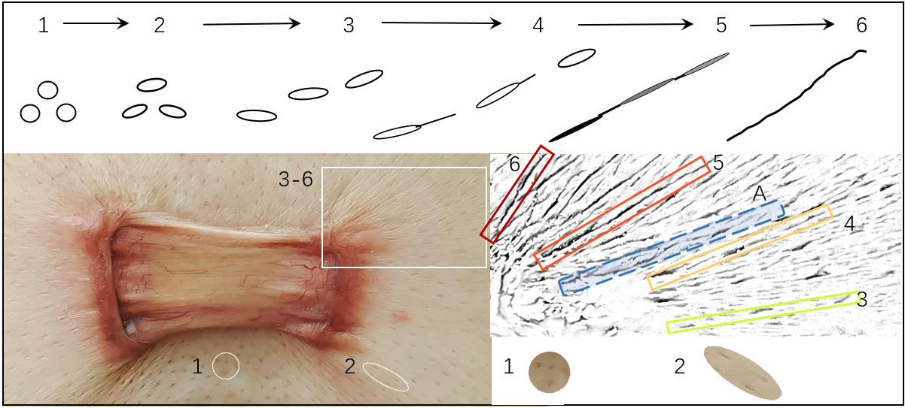
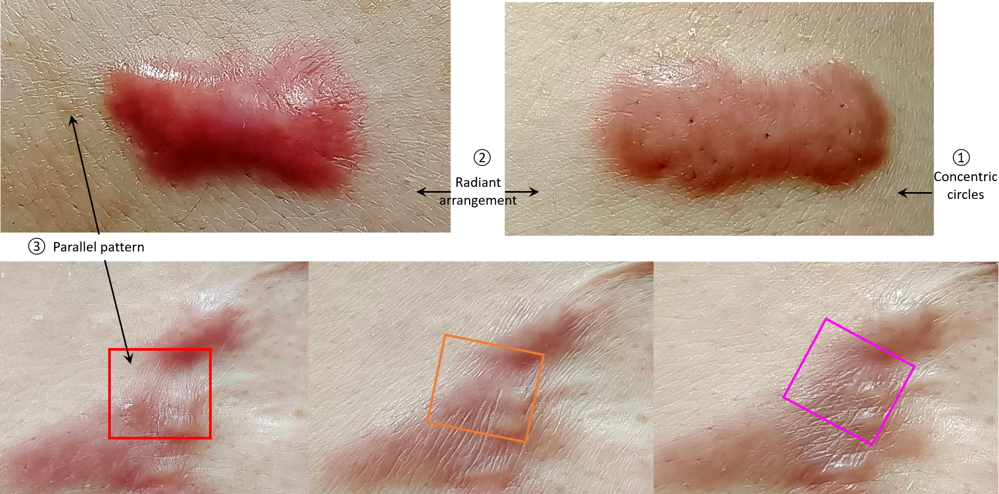
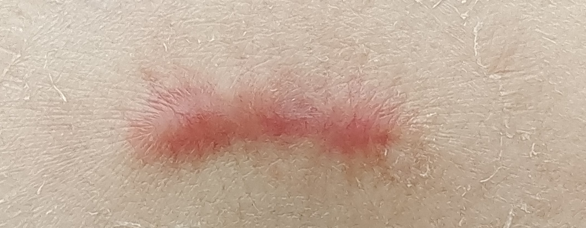
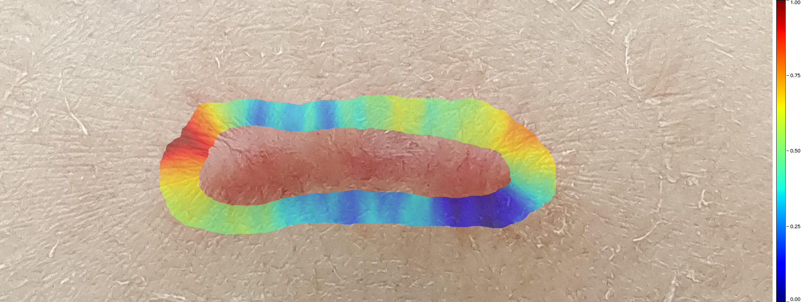
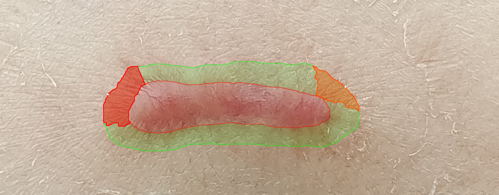
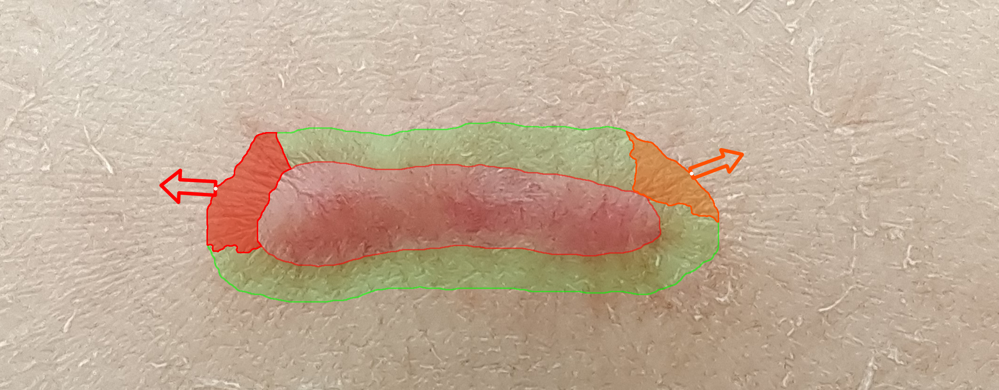
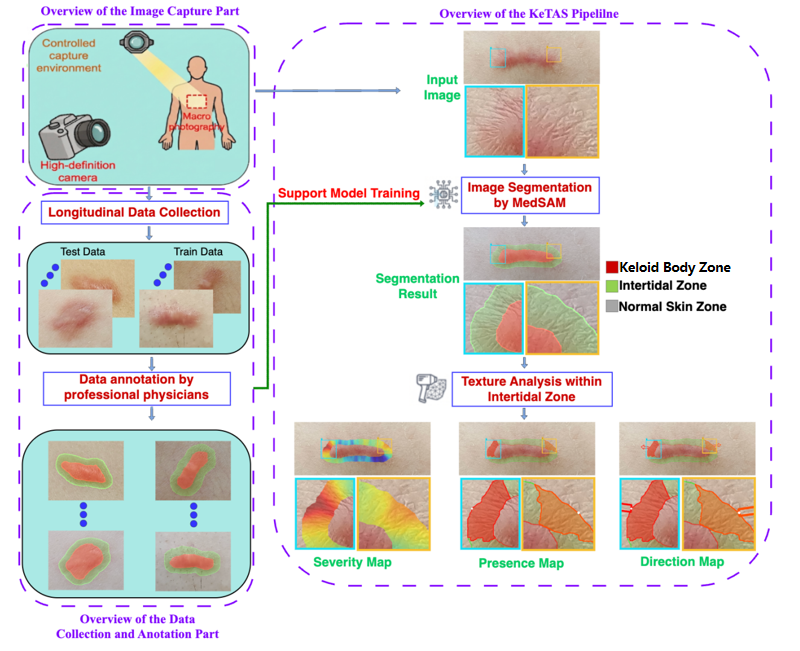
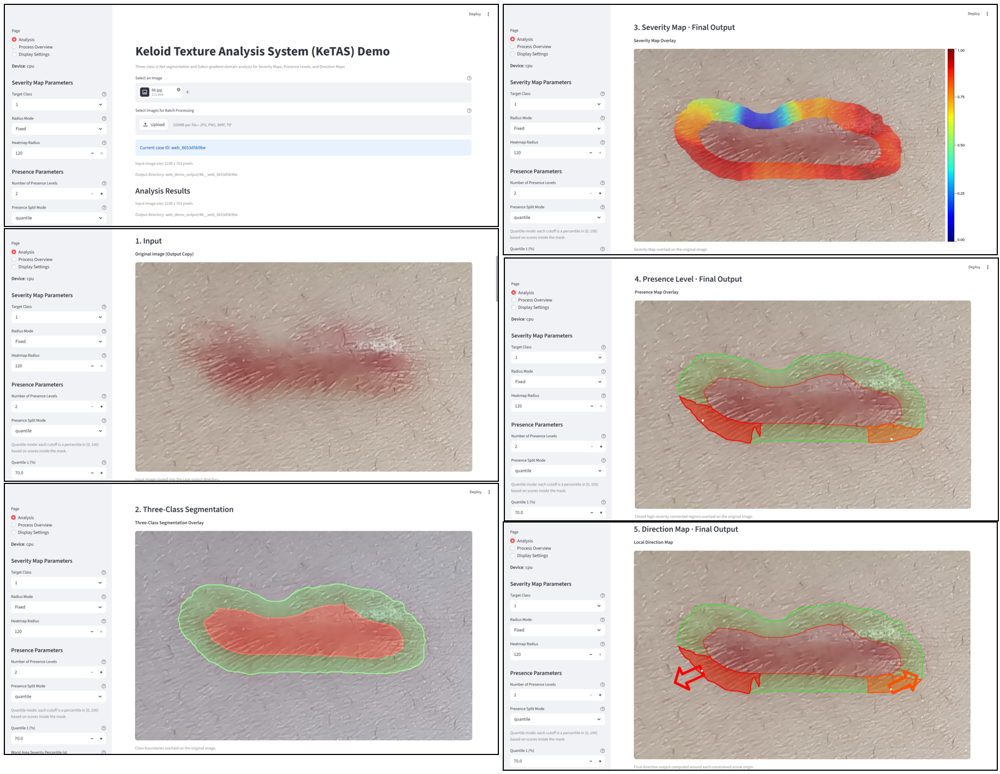
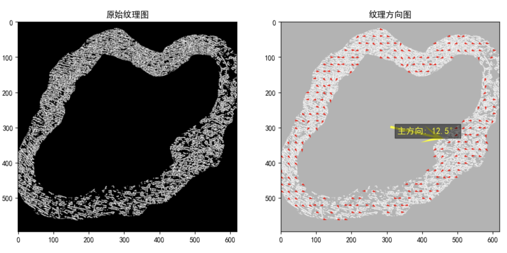
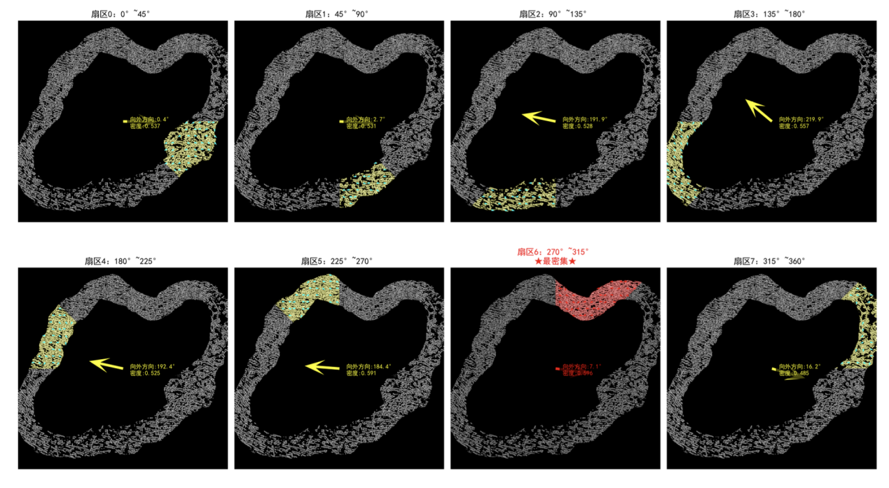

<!-- Converted from: Manuscript-Huang 2026-8-17(1).docx; Word comments are retained inline as blockquotes. -->

# Introduction

Keloids, as the typical cutaneous pathological scars, serve as the hub connecting soft tissue fibrosis and tumors[^1]. On the one hand, the histological features of excessive connective tissue deposition in the reticular dermis confined keloids within fibrotic disease[^2]; while on the other hand, their quasi-neoplastic behaviors such as the lifelong aggressive invasion into the adjacent healthy skin beyond initial injury/infection and frequent post-therapeutic recurrence highlight keloids as the most severe type of fibroproliferative conditions1, with the only differences from cancers in having no atypia or intrinsic metastasis. Specifically, keloid invasion is closely related to local mechanics, as supported by the fundamental explorations in mechanobiological mechanisms (e.g. mechanoresponsive gene of asporin[^3] and mechanosignaling of Wnt/β-catenin[^4]) and clinical effectiveness of serial tension-releasing mechanotherapeutic strategies[^5] (e.g. incision with minimized tension[^6] and square-flap surgery[^7]). Thus, to trace dynamic changes thereby discovering rules behind keloid local invasion in response to real mechanical scenarios *in vivo* will benefit both fibrosis and cancer fields.

> **Word 批注（fitdx [2]，2026-08-19）**：力生物学，支持Discussion 7

Until now, <mark>少个台阶，补平</mark>the etiology of keloidogensis remains unclear and the therapeutic effects remain limited. Thus, there is a surging demand for ealy diagnoses of its initiation/recurrence and progression, aiming at early, sensitive, accurate, repeatable and traumaless local diagnostic indices. Unfortunately, the available evaluation of keloidgoenesis currently are still confined within unfocused all-inclusive methods, such as 1) static and morphological gradings of keloid size, shape and erythema, as well as 2) the subjective symptom scores in varied scales[^8] \[e.g. Vancouver scar scale (VSS), Patient and observer scar assessment scale (POSAS), and Japan scar workshop (JSW) scar scale (JSS)[^9]\], the results of which can only be verified by the post-surgical histological reports and can hardly meet the clinical requirements during the life-long invasion. Specifically, traditional quantitative diagnosis in other disease models focusing on dose-effect relationship and threshold assessments are difficult to implement during keloidogenesis, because the disease grading and staging in keloids are unattainable. Actually, the challenge lies in that the local invasions with minute externalized changes in the surface of skin during keloidogensis can hardly be arrested by traditional assessments such as systemic blood sampling, deep radiological evaluations, rough superficial soft tissue ultrasound examinations, or late histological testings. Thus, a novel diagnostic system form scratch out of the available clinical evidences for ealy diagnostic indices is in thirsty need for intricate quantifications to monitor and analyze the keloid local invasion in a non-invasive, sensitive, dynamic, real-time, customized, and self-verifiable style.

> **Word 批注（fitdx [2]，2026-08-21）**：请黄老师添加一句话过渡。

According to the dynamic clinical obervations, we noticed that during the progressive streching-induced growth of keloids, the skin surface texture surrounding the keloids undergoes changes from an indiscintct stage to full emerge, as exemplified in Fig. 1. Brifely, during the continuous invasion of keloids into the adjacent healthy skin under chronic mechanical stimulations, the shape of the single hair follicle changed from round into fusifum. Gradually, these dotted deformed hair follicles presented in a dash-line style while acturally separated from one another. Further, the hair follciles begin to selectively border each other under the help of protrusion of skin textures, untilly finally the skin textures can be differentiated with naked eyes where the long axis of the fusiform is passed through by the skin texture along the direction of mechanical stimulations. Based on these keloid-specific dynamic evolution of skin textures, it is hypothesized that the intricate skin textures, if dynamically and objectively evaluated, can demonstrate the existence, range, and extent of keloidogenesis, and even predict the direction of keloid invasion, under the help of artificial intelligence (AI).

**Fig. 1. The captured dynamic formation of skin texture during keloidogenesis**

During the continuous invasion of keloid into the adjacent healthy skin, there accompanied dynamic process of the emergence of skin textures around the invasion edge. In responsive to the local mechanical stretching, the shape of the single hair follicle changed from round (1) into fusifum (2). Gruadually, the original regular lattic pattern of dotted hair follicles differentiated into a dash line arrangement (3), though leaving each fusiform separated with eath other. Further, the progressively elongated and flattened fusiform began to border with adjacent neighbors selectively under the help of protrusion of skin textures (4), with the origal location of hair follicles identified (5). Until finally skin textures fully formed (6), when the continuously deepened and thicked textures can be traced by naked eys, connecting each hair follilcle by passing through the long axis of the fursiform along the direction of mechanical stimulations. If the observation filed is large enough, the skin texture can demonstrate a rollback trend (e.g. from 6 to 3 in A) during the continuous moving outward from lesion to normal skin.

In recent years, AI for medicine has achieved remarkable progress in targeted and precise assessment. Generalist medical foundation models, such as MedSAM and MedSegX, have driven the development of the entire field. Building on these advances, specialized generalist models for individual clinical disciplines have attracted further attention—for example, PanDerm and SkinGPT-4 for dermatology, and MIRAGE for retinal OCT image analysis in ophthalmology. Furthermore, substantial progress has also been made recently in the development of even more specialized models for single diseases, such as the AMIE large language model for assisting the diagnosis of genetic cardiomyopathy and AI-guided CRISPR screening for identifying potential therapeutic targets in psoriasis.

In this paper, we develop an AI-driven system for predicting keloid invasion by analysing local skin textural structures, termed the Keloid Textural Analysis System (KeTAS), to get an assessment index to capture the explicit local morphological indicators during keloidogenesis, indicating the existence, range and even direction of keloid invasion, and far beyond what could be habitually estimated from the itchiness/pains of the already externalized red invading edge of keloids. First, the keloid images are captured with a high-definition camera for the high-resolusion texture information. Second, the keloid body zone, normal skin zone, and the intertidal zone between them are segmented from AI foundation model-based segmentation. Third, a novel keloid index, named **Ke-index**, is calculated via mathematical modeling on the Gabor-gradient domain of skin textural structures in segmented area. This Ke-index covers three clinical diagnostic indicators (CDIs), which quantify the severity, presence, and direction of keloid invasion. Thus, Ke-index can greatly help clinicians to judge keloid invasion for diagnosis, evaluate its existence and range for clinical decision, and further predict invading direction for preventive interventions. The proposed Ke-index with its indicators successfully meets the clinical expectation in evaluating keloidogensis in a non-invasive, sensitive, dynamic, real-time, customized, and self-verifiable way. It can also provide examples for fibrotic and tumor fields in digitalizing their progression as in their priori keloid counterpart.

> **Word 批注（fitdx [2]，2026-08-19）**：已修正

> **Word 批注（fitdx [2]，2026-08-19）**：已修正

# Results

## (1) Association between skin textural structure and keloid invasion:
<mark>Out of the first-hand clinical evidences, we discover an association between skin textural structure and keloid invasion, facilitated by experienced clinicans specializing in keloid managements. Clinical information demonstrated by skin textural structures at the periphery of keloid during its local invasion include: (1) the skin textural structure crosses the boundary between the redness of keloid invasive periphery and the adjacent normal skin thereby covering both sites (Fig. 3a), which we named Intertidal Zone (IZ); (2) the originally parallelized-arranged skin texture can be squeezed into concentric circles centripetal towards keloid center or radiantly arranged outward into the adjacent healthy skin (Fig. 3), the latter of which indicating active aggressiveness (Fig. 3b); (3) the radiantly arranged skin texture is frequently seen in the invasive front, which is consistent with direction of the local mechanical stimulation and the typical site-oriented keloid shape (e.g. butterfly in the chest) (Fig. 1b); and (4) as the dynamic and responsive reaction to the chronic local mechanics, the instant skin textural changes in morphology precede the histological structural manifestations, thereby potentially externalizing the missing link between the functional mechanical stimulation and the manifested structural mass formation.</mark>

> **Word 批注（fitdx [2]，2026-08-21）**：需要黄老师修正，现在的版本是从纹理形状角度解释的，是不是根据新的fig1改成新的解释角度？？？？

**Fig. 5. The recognized clustered skin textures can provide invasion-related inforamtion through their distribution patterns**

## (2) KeTAS:
We developed an AI-driven system for predicting keloid invasion, termed the Keloid Textural Analysis System (KeTAS) (Fig. 2). The system consists of three core modules: an image acquisition module designed to capture high-resolution, detailed skin surface textures; a large foundation model based image segmentation module that distinguishes the intertidal zone from normal skin zone and the keloid body zone; and a mathematical modeling based Gabor-gradient feature analysis module that operates on the segmented intertidal zones to enable accurate, generalizable, and reliable prediction of keloid invasion.

Compared with other AI methods, KeTAS exhibits superior advantages in interpretability, freedom from hallucinations, generalization ability, and robustness. By decomposing the entire analysis into image segmentation and Gabor-gradient feature analysis handled by large foundation model and mathematical modeling respectively, our framework effectively harnesses the complementary strengths of both paradigms. This strategy not only obtains strong generalization and robustness while mitigating critical limitations of pure AI methods such as hallucination and poor interpretability, but also obtains highly interpretable and hallucination-free analytical results while overcoming the drawback of pure feature analysis methods which can hardly effectively incorporate knowledge encoded in large annotated datasets.

Notably, KeTAS allows comprehensive assessment of keloid invasion, including its severity, presence and direction, which is far more informative than existing conventional clinical evaluation. More importantly, KeTAS makes it possible to quantify the severity, presence, and direction of keloid invasion in a non-invasive, sensitive, dynamic, real-time, personalized, and self-verifiable manner.

Accordingly, KeTAS holds great potential to assist clinicians in identifying keloid invasion for early diagnosis, assessing its spatial range and degree for treatment planning, and further predicting its invasive direction to guide preventive interventions.

1)  Input image. (b) Indicator of severity.

2)  Indicator of presence. (d) Indicator of direction.

<mark>**Fig. 2 Indicators of KeTAS**</mark>

> **Word 批注（fitdx [2]，2026-08-21）**：请黄老师确认，这样布局是否可以，图片细节是否足够

## (3) Ke-Index and three indicators:
Using KeTAS, Ke-index is obtained with the following three medical diagnostic indicators:

**Indicator of Severity**: The indicator of severity of keloid invasion, derived from local texture density and orientation consistency.

**Indicator of Presence**: The indicator of the presence of keloid invasion (whether the keloid is growing actively), derived from the severity scores and spatial relationships of different points across different regions.

**Indicator of Direction**: The indicator of the direction of keloid invasion, derived from texture direction analysis of KeTAS within the presence regions.

**Fig.3. Verification of KeTAS**

## (4) Verification:
    Sensitivity, accuracy, and repeatability of those indicators have been repeatedly verified during the dynamic processes of clinical observations and evaluations. An example is shown in Fig. 3. (1) **Sensitivity**. The *dyanamic* skin texture highly sensitive and responsive to local motions in an instable way, when repeatedly operated for a long-enough period, can solidify into *static* skin textures and externally presented as stable signals. Such early signals can be captured by our system when initially appeared, before the traditional and late histological evidences can be manifested meaningful. (2) **Validity**. The assessments of keloid invasion for each invividual from the perspectives of its severity, presence and direction have been extended for <mark>additional 6 months</mark>, aside from the standard obervasion period, which allows for presenting thereby verifying the skin texture assessment of the local invasion in a dynamic way to ensure the accuracy of our evaluations. (3) **Repeatibility**. For all the patients, whatever therapeutic strategies they prefer and finally choose, pharmaceutical palliative treatment or surgical resection followed by postherapeutic radiation therapy (Figures), the development, invasion or recurrence of keloidogensis was cross-validified accordingly as mentioned in (2) to guarentee the assessment homogeneity among different locations and courses of the disease, as well as different patient individuals, genders, and ages, at the least under the current research capacity. And (4) **Reliability.** The reliance on specialized imaging hardwares such as camera and lens is low during image acquisition in our system. Additionally, the topical interference during figure recognition is minimal for non-dermatoglyphic confounding variables such as hair strand, skin debris, and topical drug residues. Under such deliberatedly guided superior signal-to-noise ratios, the reliability dermatoglyphic assenssment afterwards can be enhanced accordingly.

> **Word 批注（fitdx [2]，2026-08-21）**：需要黄老师确认

（5）Design Methodology of Specialized Models for Single-Disease：

As AI research in medicine delves deeper into individual, highly specific diseases, the problems that AI models need to address have evolved substantially. Generalist medical models focus on universal tasks such as classification and segmentation. By fine-tuning on datasets across diverse diseases for these shared tasks, such models gain generalized capabilities for disease-level classification and segmentation. In contrast, for single-disease applications, beyond standard classification and segmentation, models must typically solve specialized, disease-specific tasks tailored to unique clinical characteristics. For example, in keloid diagnosis as presented in this work, estimating the direction of lesion growth represents such a task. These disease-specific problems are often structurally complex and cannot be adequately modeled within the standard framework of generic classification or segmentation.

In addition, data collection and annotation for individual diseases are far more challenging than for generalist models. As a result, the common paradigm of fine-tuning large pre-trained models using extensive datasets carries significant risks in single-disease scenarios. It conflicts with the constraints of limited data volume, as well as core clinical requirements: interpretability, avoidance of model hallucinations, and minimization of diagnostic errors.

Conversely, focusing on a single disease greatly reduces variability in the problem space and narrows the scope of modeling to a well-defined target, which substantially lowers the difficulty of white-box modeling.

Based on this characteristic, we propose a paradigm of specialized models for single-disease:

leveraging large foundation models to handle universal tasks, while solving the remaining fine-grained, disease-specific problems through mathematical modeling. This hybrid strategy enables efficient, accurate, and interpretable decision-making.

In this work, we focus on keloid invasion and activity analysis as a target application. We present a framework that combines large models for general tasks (e.g., lesion segmentation) with mathematical modeling for end-task-specific inference (e.g., growth direction and active region estimation). In this way, we derive a specialized AI model adapted to the unique clinical demands of keloid diagnosis and treatment guidance.

# Discussion

**（Results：1:KeTAS自动进行皮纹—瘢痕疙瘩分析，2:临床发现皮纹—瘢痕疙瘩关联，3:潮间带index和3个指标）**

1: Significance of Combining Foundation Models with Mathematical Modeling

KeTAS proposes a hybrid strategy combining artificial intelligence (AI) foundation models with mathematical modeling methods of traditional visual texture analysis in the Gabor-gradient domain, which effectively solves the inherent defects of current mainstream end-to-end methods to deal with specialized tasks. Although pure large-model schemes in the field of existing medical diagnosis have made considerable progress, they have problems such as high training difficulty, easy occurrence of "hallucinations" in results, and insufficient reliability. In contrast, mathematical modeling based visual analysis methods have stronger interpretability and stability but are difficult to fully utilize the knowledge advantages contained in big data and large models, and have limited ability in mining disease-specific features.

This study achieves complementary advantages through task decoupling: for the standard classification task of image segmentation, which requires a great deal of prior knowledge on keloid morphology, the MedSAM model, which has been fully verified in similar medical segmentation tasks, is adopted and fine-tuned using our manually carefully annotated keloid segmentation data to adapt to the task in this paper; for the non-standard task of texture direction analysis (where it is difficult to obtain large-scale supervised data), the mathematical modeling based visual analysis method in the Gabor-gradient domain with artificially designed texture direction features is adopted to achieve accurate and hallucination-free result output. This task decoupling strategy not only gives full play to the advantages of pre-trained large models and the value of existing manually annotated keloid data but also effectively avoids the unreliability problems caused by pure large models, providing a better solution for keloid diagnosis.

**2: Significance of Objective Quantitative Diagnosis**

The diagnosis of keloids has long relied on subjective clinical evaluation; even a few objective indicators are highly dependent on physicians' experience, leading to significant differences in diagnostic results among different medical institutions and physicians, which seriously restricts the standardized development of the field. Our developed KeTAS and standardized analysis method greatly reduce the reliance of diagnosis on subjective judgment, realize consistent diagnosis across institutions and physicians, provide a key technical path for the standardization of keloid diagnosis, and offer strong support for the large-scale promotion, cost control, and efficiency improvement of the diagnosis and treatment of this disease.

**3: Significance of the Strong Correlation Between Skin Texture and Keloid Invasion**

One of the core findings of this study is the existence of a strong correlation between skin texture morphology and keloid invasion, which has not been reported in the field. This finding not only provides a new quantitative tool for evaluating the degree (intensity and direction) of keloid invasion but also offers important clues for analyzing the pathogenesis of the disease, opening up a new direction for exploring the inherent laws of the occurrence and development of the disease. <mark>We also provide the potential mechanism underlying the correlation between skin texture and keloid invasion in Discussion 7.</mark>

> **Word 批注（fitdx [2]，2026-08-21）**：需要黄老师确认

**4: Significance of Effective Clinical Self-Validation**

> **Word 批注（fitdx [2]，2026-08-21）**：需要黄老师确认，我把自验证相关的段落合并了。三段各司其职，逻辑链条递进：1 段：算法输出指标 KeTAS 的直接实验证据（图 3 现象） 2 段：从现象往下挖，皮肤纹理形态学机制解释 3 段：对上述全部结果做总结，阐述研究贡献和转化价值

<mark>As shown in Fig. 3, the self-verifications of our KeTAS results, both static and dynamic, are proved credible and effective. Statically, inside the intertidal zone, the three indictors of severity, presence and direction, separately deducted by KeTAS automatically, can fullfill the loop through cross-validications among the three, with progressive refresh and refinement. Further outside the intertidal zone, our direction index for coming invasion is echoed by the long axis of fusiform-shaped hair follicles in the ajacent healthy skin, although their sensitivity can outweigh specificity as collateral evidences. And dynamically, all the three indicators can have their factual evidences for direct confirmation during the continuous obervations where keloid invasion is truly following what the KeTAS direction indicates earlier. Such an abiding behavior is additionally supported by the visible enlargement and edema of the keloid mass in designated area and direction.</mark>

<mark>The recognizable skin textures function as the dynamic and responsive reaction to the chronic mechanical stimulations during local keloid invasion. Thus, the instant skin textural changes precede the histological structural outcomes. Initially, the concentric circle districution of skin textures around keloid edges (①) indicated less invasion than radiant arrangement (②) where the invasion direction was being selected. And it was not until the parallel-patterned skin textures (③) be formed can the true ingrowth of the red keloid be recognized, along the decided invasion direction indicated by the collective paralleled alignment of skin textures. And accordingly, keloid growth is along the directional trail indicated by skin texture, as shown by the gradual changes within red, orange, and pink boxes, towards additional keloid tissue formation, thereby potentially externalizing the missing link between the functional mechanical stimulation and the manifested structural mass formation during keloidogenesis.</mark>

<mark>The results of clinical dynamic self-validation confirm that the newly discovered intertidal zone and the Ke-index with three indicators of severity, presence, and direction of keloidogenesis have good effectiveness. This not only verifies the reliability of the technical scheme proposed in this study but also fully confirms the scientificity, accuracy, and efficiency of the entire process, including data collection, processing, analysis, and the calculation of indexs and indicators. Furthermore, it proposes new indicators for predicting the degree and direction of the chronic invasion process of keloids, laying a solid foundation for subsequent clinical transformation.</mark>

**<mark>6. 为什么不看单个更早的单个毛囊而看皮纹(充分性+必要性+最早可识别)</mark>**

Currently we evaluated the dynamic changes in skin textures during keloidogenesis, rather than the earlier single hair follicles, because (1) During the mechanic-dependent formation of skin textures, it is only after the full emergence of skin textures, can the most impacted and affected hair follicles be decided, with their fusiform shape stabilized and long axis run through the detected skin textures on after another; (2) It is the continuous and fixed skin textures that can be differentiated by naked eyes or pictures taken, while the instable and demarcated hair follicles in lattic or slightly deformed pattern in the entire field served more as interference than contributing factors; (3) It is the full-formed clustered skin textures that help provide collectively the informative patterns through various distribution patterns (Fig. 5). And the longer the keloid course, the thicker, longer, and more typical the skin textures will be in facilitating clinical decision-making. For examples, the concentric circle districution of skin textures around keloid edges indicated less invasion than radiant arrangement where the invasion direction was being selected. And it was not until the parallel-patterned skin textures be formed can the true ingrowth of the red keloid be recognized, along the decided invasion direction indicated by the collective paralleled alignment of skin textures.

**<mark>7. 认知升级：引入GRID新概念</mark>**

<mark>Based on our new discoveries on KeTAS practically, we further propose theoretically the *‘graphical relay interwoven displaceable network (GRID)’* as the potential mechanism underlying the skin texture phenomenon. Briefly, (1) *Graphical (G)* - the embryonically patterned prestress filed manifesting as skin tension lines with hair follicles being posts arranged in a dot-matrix pattern inside the grid, reflecting anisotropic mechanical properties of skin. It reflects that the quasi-neoplasitc keloids \[</mark>[^10]<mark>\] continue to grow in the direction of predominant skin-stretching tension \[</mark>[^11]<mark>\], which is supported in their tumor counterpart as clarified in the 3D morphogenetic blueprint for metastatic outgrowh in breast cancer \[</mark>[^12]<mark>\]; (2) *Relay (R)* – the dynamic relay propagates across adjacent hair follicles within the integument, reflected in the the mechanical force-mediated myofibroblast-fibroblast cross talk via fibrous matrix as the single-cell-level paratensile signaling and in its application in elucidating tissue-level fibrosis expansion \[</mark>[^13]<mark>\]. This is further clarified in keloidogenesis where disrupted inter-fibroblast mechanocommunications promote keloid progression \[</mark>[^14]<mark>\]; (3) *Interwoven (I)*. This interwoven architecture permits topological reconfiguration guided by mechanical stimulations, as supported by the effectiveness of punch exicision in keloid therapy achieved through biomechanical redistribution of tension vectors and tissue laxity recruitment through genometrically optimized punch distribution \[</mark>[^15]<mark>\]; and (4) *Displaceble (D)*. The interwoven architecture is inherently displaceable above a yield threshold, potentiating topological reconfiguration under mechanical modulation, as the physical basis for therapeutic effectivenss in toplogical intervensions such as tension-reducing sturues and Z-palsties \[</mark>[^16]<mark>\].</mark>

<mark>Such dynamic skin textures based on our GRID mechanism are different from those decriptive and phynomenogolical dynamic/static wrinkles in plastic/dermagologic/asthetic clinical practices. The mechanicstic skin textures in GRID system are mechanicistic and underlying anchored load-bearing network. Thus, static and dynamic wrinkles represent two-dimensional surface projections of the GRID network, while keloid infiltration represents pathological actualization of the interwoven dimension itself. The displaceable dimension constitutes the physical basis for therapeutic reversibility, unifing all effective mechanotherapeutic interventions through modulating the displaceability of the dermal GRID.</mark>

**8: Future Extended Applications of This Work**

The KeTAS proposed in this study provides a feasible scheme for the standardization of keloid skin texture analysis and diagnosis, with significant potential application value—it is expected to become a routine non-invasive, sensitive, dynamic, real-time, personalized, and self-verifiable objective evaluation tool in clinical practices such as keloid diagnosis, treatment, and prevention (corresponding to the positioning of "a non-invasive, sensitive, dynamic, real-time, customized, and self-verifiable way" in the Introduction section), similar to the standardized status of platelet detection in blood tests. Promoting the KeTAS system and the corresponding Ke-index with the three indicators to medical institutions at all levels can realize the unification and standardization of the keloid diagnosis process, provide credible and high-quality diagnostic basis for the majority of patients, build a low-cost and high-efficiency social medical foundation for keloid diagnosis, and help upgrade and improve the medical system in the field of diagnosis and treatment of this disease.

<mark>Such a keloid-specific KeTas system by skin textures are endowed with characteristic features. (1) *<u>Morphological manifestation of functions</u>*. As a mechano-sensitive and -responsive disease, keloid demonstrates stretching-dependent invasion. The mechanic stimulations include mainly contraction of underlying skeletal muscles, meanwhile covering hearbeating and breathing with fixed rhythm and frequency. Such complex functions of movements can hardly be monitored independently, not to say be packaged into a comprehensive map. Fortunately, those functional changes can be traced in the superficial skin textures and explicated by our KeTAS system and GRID network through morphological manifestations. (2) *<u>Static manifestation of dyanmic invasion</u>*. The quasi-neoplastic continuous invasion is the iconic feature of keloid as benign fibrotic disease. The presence, distribution, severity, and direction of such dynamic processes can be collectively catptured and reflected as perodic pictures in the statical forms of changes in density, depth, thickness and direction of skin textures. (3) *<u>Quantifiable manifestation of highly differentiated features</u>*. In contrast to the traditional subjective evaluation of keloid severity through qualified or semi-quantified questionnaire, the recognizable and traceble skin textures can provide objective information thorugh our KeTAS system. (4) *<u>Early capture of invasion information</u>*. Traditional golden standard of keloidogenesis is the histological findings of hyalinized collagen fiber under the microscope by pathologists after surgical excision. Such a lagging histological finding merely for diagnosis is too late meanwhile far from the practical expectations towards traumaless diagnosis, non-invasive intervention, and early prediction before true growth happens, for which KeTAS can provide full solutions. (5) *<u>Preparation for potential inverventions</u>*. Traditional grading system for diagnosis is upgraded into the new one focusing on both the established skin texture outcomes through KeTAS system and the emerging processes through GRID network, leaving full spaces for potential novel inverventions and prophylacsis.</mark>

Besides, our KeTAS provides a paradigm with static skin texture as an early diagnostic system of disease progression integrating the qualitative (to initiate or not), quantitative (the severity) and directional information, meanwhile covering the whole course of the disease and varied therapeutic strategies. Additionally, it is applicable not only in disease diagnosis, but can also guide selecting prophylactic procedures and modifying therapeutic strategies for both doctors and patients. Thanks to the advances in AI, the successful applications of our KeTAS during keloidogensis in the largest and most superfical organ of skin inside human body indicate a promising future for development potentials in other chronic diseases and organs with the striae-like apperances, such as fibrosis or tumors, where keloids serve as a hub connecting through not only the invasion behavior but also morphological indicators.

Indeed, the keloid-specific skin textures provides a typical link between scar mechanobiology as fundamental explorations and scar mechanotherapy as practical applications. Under the dyamic evaluations thorugh skin textures around keloids to the local mechanics, our discoveries in KeTAS system and GRID network can (1) provides sufficient information to diagnosis, therapeutics and prophylasixs for clinical decision-making, which can radically upgrade the theragnostic strategies in patholcial scars; (2) provides a typical demonstration for fibrosis and tumors to learn. Keloids are the typical example of dermal fibrosis demonstrating quasi-neoplasctic featues. As long as the continuous invasion can be monitored and evaluated during keloidogenesis, the KeTAS system and accordingly the GRID network can be borrowed into fibrogenesis and tumorigenesis, to ignite more fascinating findings and applications.

<mark>9. 为什么能动态观察有足够量的图片而不牺牲患者的利益</mark>

<mark>Our clinical obervations of the skin textures are available during daily standarized keloid managements (e.g. external phamaceuticals, laser therapy, costosterioid injection, or surgery following by irradiation) according to the preference of the patients and feasibility for the treatments, aiming to benefit the patient to the most. Considering that keloid can result from minute folliculitis or after trauma/surgery with frequent post-surgical recurrence, the KeTAS is particularly suitable for those: (1) with their preference for conservative treatments, especially those with family history; (2) with refractory keloids and multiple post-surgical recurrences; and (3) with multiple spreading and progressively new lesions.</mark>

> **Word 批注（fitdx [2]，2026-08-21）**：请黄老师审定，我把这项放到最后了

# 4. Methods

In this study, we enrolled a total of xxx adult outpatient patients with keloids located on the chest, scapula, or abdomen, who received clinical treatment at Beijing Tsinghua Changgung Hospital from xxxx to xxxx. Standardized macro photography was performed during each follow-up visit to dynamically record the subtle changes in keloid skin texture, with all data strictly processed to avoid privacy disclosure.

> **Word 批注（fitdx，2026-07-30）**：数据来源介绍

**Fig.2. Pipeline of KeTAS.** The pipline include data capture, data annotation, and data processing (segmentation with Gabor-gradient domain analysis). The system obtains a novel index of intertidal zones and three indicators of severity, presence, and direction of keloid invasion.

**Figure 5. Software developed for running KeTAS.**

Based on clinical observations of the inherent correlation between skin texture structure and keloid invasive progression, we propose a novel **Keloid Texture Analysis System (KeTAS)** consisting of three core modules: standardized **keloid image acquisition**, large foundation model based **keloid region segmentation**, and mathematical modeling based **Gabor-gradient domain texture analysis** for keloid invasion assessment. (1) The standardized keloid image acquisition ensures clear and high-definition imaging of detailed skin textures. (2) The keloid region segmentation module partitions input keloid images into three anatomically and pathologically distinct regions: the normal skin zone with intact skin tissues free of keloid invasion, the intertidal zone featuring ongoing invasive progression at the lesion boundary, and the keloid body zone with fully invaded and diseased skin tissues. (3) For the critical intertidal zone closely related to keloid invasion, we propose Gabor-gradient domain texture analysis for keloid invasion assessment, and generates three quantitative invasion **indicators**: **severity** which reflects the degree of keloid invasion, **presence** which highlights high-risk invasive regions, and **direction** which characterizes the specific invasive orientation of high-risk invasive regions. These three indicators construct the Ke-index for comprehensive quantitative evaluation of keloid invasion.

Different from conventional end-to-end large vision model paradigms, our pipeline decouples the analysis into two collaborative stages: large foundation models to handle the universal task of keloid region segmentation where high-quality manual annotations and large-scale labeled datasets are feasible, and mathematical modeling in the Gabor-gradient domain to solve the remaining fine-grained, disease-specific texture analysis problems where manual annotations are extremely difficult, subjective, and irreproducible. This design effectively avoids the data scarcity and annotation subjectivity bottlenecks of end-to-end learning, ensuring the accuracy, interpretability, and clinical practicability of keloid invasion quantitative analysis.

## 4.1 Keloid image capture

In the image acquisition stage, we center the target keloid in the image and capture images using a high-definition macro camera. This ensures that the captured images can obtain clear textural details of the keloid and its surrounding regions, facilitating subsequent processing and analysis.

## 4.2 Keloid region segmentation

We segment keloid images into three types of regions: normal skin zone, intertidal zone, and keloid body zone. The normal skin zone refers to the skin area that has not been eroded or affected by keloids; the keloid body zone is the area where the skin has been completely infiltrated by keloids; the intertidal zone, proposed in this paper, is the junction area between the normal skin zone and the keloid body zone. According to this definition, for the keloid images captured in Section 4.1, we manually annotated these three types of zones with the assistance of clinicians to construct annotated images containing segmentation labels of the three zones, which can provide supervision for model training (see Fig. 2 for an example).

To achieve automatic segmentation of these three zones, we adopt MedSAM, a state-of-the-art AI foundation model in the field of medical segmentation, as the basic architecture, i.e.

<table>
<colgroup>
<col style="width: 6%" />
<col style="width: 86%" />
<col style="width: 6%" />
</colgroup>
<tbody>
<tr class="odd">
<td></td>
<td>
<strong>M</strong> = <em>M</em><em>e</em><em>d</em><em>S</em><em>A</em><em>M</em>(<strong>I</strong>)

<strong>M</strong><strong>B</strong><strong>Z</strong> = 𝕀[<strong>M</strong> =  = 1],

<strong>M</strong><strong>I</strong><strong>Z</strong> = 𝕀[<strong>M</strong> =  = 2],

<strong>M</strong><strong>N</strong><strong>Z</strong> = 𝕀[<strong>M</strong> =  = 3],
</td>
<td>(1)</td>
</tr>
</tbody>
</table>

where $\mathbf{M}$ denotes the segmentation mask predicted by MedSAM from the input image $\mathbf{I}$; $\mathbb{I}\lbrack \cdot \rbrack$ denotes the indicator function. $\mathbf{M}_{\mathbf{B}\mathbf{Z}}$, $\mathbf{M}_{\mathbf{IZ}}$ and $\mathbf{M}_{\mathbf{NZ}}$ denote the binary segmentation masks derived from $\mathbf{M}$ for the keloid body zone, intertidal zone and normal skin zone, respectively; each binary mask equals to 1 inside its corresponding zone and 0 elsewhere.

We fine-tune MedSAM on our annotated keloid dataset to obtain automatic regional segmentation of keloids. MedSAM is an enhancement of the Segment Anything Model (SAM) \cite{kirillov2023segment}, which adopts the Vision Transformer (ViT) \cite{dosovitskiy2020discriminative} architecture. The model follows an overall Encoder-Decoder framework, consisting of an image encoder, a prompt encoder (for processing user interactions, such as bounding boxes and text), and a mask decoder (for generating segmentation results). Specifically, the image encoder utilizes the pre-trained ViT-Base version with 12 transformer blocks, which divides the input image into 16×16 patches. The prompt encoder employs positional encoding to transform the prompt into a 256-dimensional feature vector. The mask decoder integrates the image embeddings and prompt features through cross-attention and upscales the resolution via transposed convolutions, ultimately producing the segmentation mask. CrossEntropyLoss is used as the loss function for this multi-class segmentation task.

## 4.3 Gabor-gradient domain skin texture analysis

Our clinical practice observes that subtle skin texture alterations in the keloid intertidal zone can effectively reflect the latent growth trends and invasive orientations of keloid lesions. Accordingly, after obtaining precise regional segmentation results in Section 4.2, we target the intertidal zone for dedicated skin texture analysis to quantify keloid invasive areas and their corresponding propagation directions. To achieve fine-grained and reliable invasion evaluation, we develop a novel Gabor-gradient domain texture analysis method. Specifically, our method first performs **pixel-level texture feature extraction and pixel-level invasive direction estimation within the Gabor-gradient feature domain**. Based on dense per-pixel texture characterization, we further construct **three quantitative evaluation indicators,** including **severity, presence,** and **direction,** to comprehensively and intuitively quantify the invasive degree, invasive probability region, and invasive direction of keloids.

（1）Pixel-level texture and direction estimation in Gabor-gradient domain

**Figure 6. Example results of the extracted texture points within the intertidal zone using the Gabor domain analysis.**

1）Gabor domain analysis

To comprehensively extract texture features of different orientations and scales, we design the Gabor filter bank to transfer the input image into the Gabor domain, and the filters in the bank are configured with distinct direction and scale parameters. Specifically, in the direction dimension, there are 4 directions in total (0°, 45°, 90°, 135°), which can cover the main texture directions. In the scale dimension, 2 wavelength parameters (10 and 15 pixels) are adopted to capture textures of varying thicknesses. Thus, the Gabor filter bank consists of 8 filters with different direction and scale parameters. The corresponding Gabor feature is expressed as:

> **Word 批注（fitdx [2]，2026-08-19）**：kernel size9*9能实现这个吗？？？

|     |                                                                  |       |
|-----|------------------------------------------------------------------|-------|
|     | $$\mathbf{F}_{\mathbf{G}_{k}} = g_{k}\left( \mathbf{I} \right)$$ | \(1\) |

The unified parameter configuration for each Gabor filter $g_{k}$ is as follows: kernel size is 9×9 pixels, standard deviation is 3.0, aspect ratio is 0.5 (resulting in an elliptical filter), and phase offset is 0 (forming a symmetric filter). Each kernel is normalized by dividing its coefficients by 1.5 times the sum of the kernel coefficients.

After obtaining the response $\mathbf{F}_{\mathbf{G}_{k}}$ of each of the 8 Gabor filters, we linearly superimpose the responses of all 8 filters and perform normalization processing to ensure that the output range of the final texture feature map is constrained within \[0, 1\], i.e.

> **Word 批注（fitdx [2]，2026-08-19）**：（2）能保证【0，1】吗

|     |                                                                                                                                                                                                    |       |
|-----|----------------------------------------------------------------------------------------------------------------------------------------------------------------------------------------------------|-------|
|     | $$\mathbf{F}_{\mathbf{A}} = \frac{\sum_{k}^{}\mathbf{F}_{\mathbf{G}_{k}} - \min_{k}(\mathbf{F}_{\mathbf{G}_{k}})}{\max_{k}(\mathbf{F}_{\mathbf{G}_{k}}) - \min_{k}(\mathbf{F}_{\mathbf{G}_{k}})}$$ | \(2\) |

Subsequently, we binarize the extracted Gabor features $\mathbf{F}_{\mathbf{A}}$ to $\mathbf{F}_{\mathbf{B}}$. To enhance the robustness of binarization, an adaptive thresholding method is adopted to dynamically calculate the binarization threshold based on local statistics. Specifically, we use the Gaussian Weighted Average, denoted as $\mu$, for feature map binarization with an 11 × 11 local window, which introduces a Gaussian distribution-based weight assignment mechanism (i.e., higher weights for central pixels and decreasing weights for edge pixels), i.e.

|     |                                                                                                                                  |       |
|-----|----------------------------------------------------------------------------------------------------------------------------------|-------|
|     | $$\mathbf{F}_{\mathbf{B}}\mathbb{= I}\left( \mathbf{F}_{\mathbf{A}} > \mu\left( \mathbf{F}_{\mathbf{A}} \right) - 0.01 \right)$$ | \(3\) |

where $\mathbb{I}\lbrack \cdot \rbrack$ denotes the indicator function. To furthermore enhance the texture contour details (such as edge curvature and tiny protrusions) to improve the accuracy of subsequent tasks, we also adopt the Canny operator (using lower and upper thresholds of 50 and 150, followed by one iteration of dilation with a 3 × 3 kernel) for edge detection and enhancement, i.e.

|     |                                                                                             |       |
|-----|---------------------------------------------------------------------------------------------|-------|
|     | $$\mathbf{F} = Canny\left( \mathbf{F}_{\mathbf{B}} \right) \cdot \mathbf{M}_{\mathbf{IZ}}$$ | \(4\) |

The Canny operator’s result is intersected with the intertidal-zone mask $\mathbf{M}_{\mathbf{IZ}}$ to obtain the Gabor-domain analysis result **F**.

2）Gradient domain analysis

The Gabor-domain analysis result **F** has extracted texture information of different directions and widths. To extract texture direction information, we transform **F** into its gradient domain and estimate the local texture-line orientation from the gradient structure tensor. Specifically, we construct a gradient structure matrix $\mathbf{J}$ for each point $\mathbf{i}$, which is a 2 × 2 symmetric matrix, and

$$\mathbf{J}\left( \mathbf{i} \right) = \begin{bmatrix}
\mathbf{J}_{11}\left( \mathbf{i} \right) & \mathbf{J}_{12}\left( \mathbf{i} \right) \\
\mathbf{J}_{21}\left( \mathbf{i} \right) & \mathbf{J}_{22}\left( \mathbf{i} \right)
\end{bmatrix}$$

$$\mathbf{J}_{11}(\mathbf{i}) = \sum_{\mathbf{j} \in \Omega(\mathbf{i})}^{}{w(\mathbf{i},\mathbf{j}){\mathbf{G}_{x}(\mathbf{j})}^{2}}$$

$$\mathbf{J}_{22}(\mathbf{i}) = \sum_{\mathbf{j} \in \Omega(\mathbf{i})}^{}{w(\mathbf{i},\mathbf{j}){\mathbf{G}_{y}(\mathbf{j})}^{2}}$$

|     |                                                                                                                                                                                                                                                                       |       |
|-----|-----------------------------------------------------------------------------------------------------------------------------------------------------------------------------------------------------------------------------------------------------------------------|-------|
|     | $$\mathbf{J}_{12}\left( \mathbf{i} \right) = \mathbf{J}_{21}\left( \mathbf{i} \right) = \sum_{\mathbf{j} \in \Omega\left( \mathbf{i} \right)}^{}w\left( \mathbf{i},\mathbf{j} \right)\mathbf{G}_{x}\left( \mathbf{j} \right)\mathbf{G}_{y}\left( \mathbf{j} \right)$$ | \(5\) |

where $\mathbf{G}_{x}$ and $\mathbf{G}_{y}$ are the x-direction and y-direction gradients of $\mathbf{F}$ using the Scharr operator, respectively. To eliminate the influence of noise, all pixel elements in the neighboring region $\Omega(\mathbf{i})$ around each point $\mathbf{i}$ are considered to build the structure tensor, and the Gaussian weight is defined between pixel coordinates, i.e.

|     |                                                                                                         |       |
|-----|---------------------------------------------------------------------------------------------------------|-------|
|     | $$w\left( \mathbf{i},\mathbf{j} \right) = e^{- \frac{{||\mathbf{i} - \mathbf{j||}}_{2}}{2\sigma^{2}}}$$ | \(6\) |

where *σ* = max(3, floor(min(*H*, *W*)/100)), *H* and *W* are the image height and width, respectively, and the height and width of local window $\Omega$ are 6*σ* + 1.

We adopt the eigenvalue decomposition method to perform eigenvalue decomposition on the gradient structure matrix **J** of each pixel point $\mathbf{i}$.

|     |                                                                                                                                     |       |
|-----|-------------------------------------------------------------------------------------------------------------------------------------|-------|
|     | $$\mathbf{J}(\mathbf{i})\  = \ \mathbf{v}(\mathbf{i})\  \cdot \ \mathbf{\Lambda}(\mathbf{i})\  \cdot \ \mathbf{v}^{T}(\mathbf{i})$$ | \(7\) |

For the 2×2 gradient structure matrix **J**(**i**), **v**(**i**) is the 2×2 eigenvector matrix corresponding to point **i**, and **v**(**i**) = \[**v**₁(**i**) **v**₂(**i**)\]. **Λ**(**i**) is the 2×2 diagonal matrix corresponding to point **i**, and $\mathbf{\Lambda}\left( \mathbf{i} \right) = \begin{bmatrix}
\lambda_{1}\left( \mathbf{i} \right) & 0 \\
0 & \lambda_{2}\left( \mathbf{i} \right)
\end{bmatrix}$ (the diagonal elements are the eigenvalues λ₁(**i**) and λ₂(**i**)). **v**ᵀ(**i**) is the transpose of the eigenvector matrix **v**(**i**). λ₁(**i**) is the maximum eigenvalue of **J**(**i**), λ₂(**i**) is the secondary eigenvalue of **J**(**i**), i.e. λ₁(**i**) ≥ λ₂(**i**). Their corresponding eigenvectors are **v**₁(**i**) and **v**₂(**i**), respectively. The eigenvector **v**₁(**i**) corresponding to the maximum eigenvalue λ₁(**i**) represents the direction of the strongest local intensity change, which is normal to a line-like texture. Therefore, **v**₁(**i**) is rotated by 90°,$\mathbf{v}_{1}^{'}\left( \mathbf{i} \right) = \begin{bmatrix}
0 & - 1 \\
1 & 0
\end{bmatrix}\mathbf{v}_{1}\left( \mathbf{i} \right)$ , and we obtain the local texture direction by

> **Word 批注（fitdx [2]，2026-08-19）**：为什么旋转90度，太细了吧？？？

|     |                                                                                                                                               |       |
|-----|-----------------------------------------------------------------------------------------------------------------------------------------------|-------|
|     | $$\theta\left( \mathbf{i} \right) = {atan2}\left( \mathbf{v}_{1_{y}}^{'}(\mathbf{i}),\mathbf{v}_{1_{x}}^{'}(\mathbf{i}) \right)\ {mod}\pi\ $$ | \(8\) |

The resulting direction $\theta\left( \mathbf{i} \right)$ is an undirected texture axis with 180° periodicity.

**Figure 7. Example results of the estimated texture direction using the gradient domain analysis of the Gabor feature map. We divide the intertidal zone into eight sectors (marked in yellow and red). For each sector, we calculate the region average direction and the region direction consistency. According to the texture density and region direction consistency of each sector, we select the most salient sector (marked in red) and use its region average direction as the main direction of the whole intertidal zone.**

> **Word 批注（fitdx [2]，2026-08-19）**：删掉八分区子图

（2）Indicators computation

Based on the pixel-level texture features and directions estimated in the Gabor-gradient domain, we first calculate the invasive severity score for each pixel to generate the indicator of severity. Guided by the indicator of severity, we further localize high-risk regions with prominent invasive potential and construct the corresponding indicator of presence. For the identified high-risk regions extracted from the indicator of presence, we statistically aggregate pixel-level texture and directional information to estimate the dominant invasive orientation of each region, forming the final indicator of direction. Collectively, the three complementary indicators quantitatively characterize keloid invasion in a hierarchical manner: the severity reflects the degree of invasion of pixels in the intertidal zone, the presence pinpoints the spatial high-risk regions of invasive lesions in the intertidal zone, and the direction reveals the propagation orientation of high-risk regions.

1)  **Indicator of Severity**

The indicator of severity is exclusively calculated within the segmented intertidal zone to quantitatively evaluate the local invasive intensity of keloids. In this work, the invasive severity at each pixel is jointly determined by two critical texture priors: **local texture density** and **orientation consistency**. The pixel surrounded by pixels with denser invasive textures and more consistent directional distributions is assigned higher invasion severity score, indicating more active keloid invasive behaviors.

First, we compute the **local texture density**. To compute the cumulative sum of feature values within spatial neighborhoods, we define a disk filter kernel $\mathbf{K}_{\mathbf{s}}$ with all elements inside the circular neighborhood set to one. The default radius of $\mathbf{K}_{\mathbf{s}}$ is dynamically scaled according to the image short side as *r* = round(0.1\*min(*H*,*W*)). A two-dimensional convolution operation, i.e. $conv()$, is performed to statistically count valid texture pixels within each local region. The texture density map $\mathbf{T}_{\mathbf{d}}$ is formulated as:

|     |                                                                                                     |       |
|-----|-----------------------------------------------------------------------------------------------------|-------|
|     | $$\mathbf{T}_{\mathbf{d}} = \frac{\mathbf{N}_{\mathbf{F}}}{\mathbf{N}_{\mathbf{M}} + \varepsilon}$$ | \(9\) |

where $\mathbf{N}_{\mathbf{F}}$ is the number of identified texture pixels within the circular neighborhood and is obtained by

|     |                                                                                                                      |        |
|-----|----------------------------------------------------------------------------------------------------------------------|--------|
|     | $$\mathbf{N}_{\mathbf{F}} = {conv}\left( \mathbf{F},\mathbf{K}_{\mathbf{s}} \right) \cdot \mathbf{M}_{\mathbf{IZ}}$$ | \(10\) |

$\mathbf{N}_{\mathbf{M}}$ represents the total number of valid pixels belonging to the post-processed intertidal-zone mask within the same circular neighborhood and is obtained by

|     |                                                                                                                                    |        |
|-----|------------------------------------------------------------------------------------------------------------------------------------|--------|
|     | $$\mathbf{N}_{\mathbf{M}} = {conv}\left( \mathbf{M}_{\mathbf{IZ}},\mathbf{K}_{\mathbf{s}} \right) \cdot \mathbf{M}_{\mathbf{IZ}}$$ | \(11\) |

Second, we quantify the **orientation consistency** to characterize the uniformity of local orientations. Given the estimated direction $\theta$ via the Gabor-gradient feature responses by Eqs. (5)-(8), to eliminate the inherent 180° directional periodicity of texture orientation, we double the angular value and obtain the cosine and sine responses $\mathbf{V}_{\mathbf{c}}$ and $\mathbf{V}_{\mathbf{s}}$, respectively, i.e.

> **Word 批注（fitdx [2]，2026-08-19）**：这里需要给个例子解释一下，比如1度和179度的平均应该是0度而不是角度的算术平均90度

<table>
<colgroup>
<col style="width: 6%" />
<col style="width: 86%" />
<col style="width: 6%" />
</colgroup>
<tbody>
<tr class="odd">
<td></td>
<td>
<strong>V</strong><strong>c</strong> = cos (2<em>θ</em>)

<strong>V</strong><strong>s</strong> = sin (2<em>θ</em>)
</td>
<td>(12)</td>
</tr>
</tbody>
</table>

Next, the average cosine and sine responses within the local disk neighborhood defined by $\mathbf{K}_{\mathbf{s}}$ are obtained by

<table>
<colgroup>
<col style="width: 6%" />
<col style="width: 86%" />
<col style="width: 6%" />
</colgroup>
<tbody>
<tr class="odd">
<td></td>
<td>
$${\overline{\mathbf{V}}}_{\mathbf{c}} = \frac{{Conv}\left( \mathbf{V}_{\mathbf{c}},\mathbf{K}_{\mathbf{s}} \right) \cdot \mathbf{M}_{\mathbf{IZ}}}{{Conv}\left( \mathbf{M}_{\mathbf{IZ}},\mathbf{K}_{\mathbf{s}} \right) \cdot \mathbf{M}_{\mathbf{IZ}} + \varepsilon}$$

$${\overline{\mathbf{V}}}_{\mathbf{s}} = \frac{{Conv}\left( \mathbf{V}_{\mathbf{s}},\mathbf{K}_{\mathbf{s}} \right) \cdot \mathbf{M}_{IZ}}{{Conv}\left( \mathbf{M}_{\mathbf{IZ}},\mathbf{K}_{\mathbf{s}} \right) \cdot \mathbf{M}_{\mathbf{IZ}} + \varepsilon}$$
</td>
<td>(13)</td>
</tr>
</tbody>
</table>

We then compute the orientation consistency map as

> **Word 批注（fitdx [2]，2026-08-19）**：这里需要解释为什么可以这么计算，为什么sqrt cos和sin就是角度一致性了

|     |                                                                                                                                                        |        |
|-----|--------------------------------------------------------------------------------------------------------------------------------------------------------|--------|
|     | $$\mathbf{T}_{\mathbf{c}} = \sqrt{\left( {\overline{\mathbf{V}}}_{\mathbf{c}} \right)^{2} + \left( {\overline{\mathbf{V}}}_{\mathbf{s}} \right)^{2}}$$ | \(14\) |

Finally, the pixel-level invasion severity score is generated by weighted fusion of the texture density map $\mathbf{T}_{\mathbf{d}}$ and orientation consistency map $\mathbf{T}_{\mathbf{c}}$. The default density weight $d_{w}$ and consistency weight $c_{w}$ are empirically set to 0.7 and 0.3, respectively.

|     |                                                                                                                                                                                                             |        |
|-----|-------------------------------------------------------------------------------------------------------------------------------------------------------------------------------------------------------------|--------|
|     | $$\mathbf{S}_{\mathbf{raw}} = d_{w} \cdot \mathbf{T}_{\mathbf{d}} + c_{w} \cdot \mathbf{T}_{\mathbf{c}}$$                                                                                                   | \(15\) |
|     | $$\mathbf{S} = \frac{\mathbf{S}_{\mathbf{raw}} - \min\left( \mathbf{S}_{\mathbf{raw}} \right)}{\max\left( \mathbf{S}_{\mathbf{raw}} \right) - \min\left( \mathbf{S}_{\mathbf{raw}} \right) + \varepsilon}$$ | \(16\) |

The raw severity score $\mathbf{S}_{\mathbf{raw}}$ is normalized to constitute the normalized severity map $\mathbf{S}$, where higher pixel values correspond to relatively higher texture-based severity within the same image.

2)  **Indicator of Presence**

The indicator of presence $\mathbf{P}$ is derived from the pixel-wise severity indicator $\mathbf{S}$, aiming to automatically localize the most dominant and high-risk invasive regions within the intertidal zone. Instead of retaining all low-confidence invasive pixels, we screen out the top-ranked invasive areas and preserve only large-scale, clinically meaningful lesion regions to eliminate trivial noise interference.

Two hyperparameters are predefined in this stage: the within-image severity percentile $T_{P}$ and the top region number $N_{TR}$. Under the default settings, the threshold $T_{P}$ is the 70th percentile of valid intertidal-zone severity values, retaining approximately the highest-scoring 30% of pixels, and $N_{TR}$=2 .

The computation pipeline starts with the generation of a rough presence map. We determine the threshold $T_{P}$ corresponding to the 70th percentile of severity scores within the valid intertidal-zone mask. Pixels with severity values equal to or exceeding $T_{P}$ are regarded as candidate high-risk pixels to produce the rough presence map $\widehat{\mathbf{P}}$ by

|     |                                                                       |        |
|-----|-----------------------------------------------------------------------|--------|
|     | $$\widehat{\mathbf{P}}\mathbb{= I}\left( \mathbf{S} > T_{P} \right)$$ | \(17\) |

where $\mathbb{I}$\[·\] denotes the indicator function.

To further screen the most credible and dominant high-risk regions from the rough presence map, we adopt an iterative region-selection strategy to select up to $N_{TR}$ connected regions with the highest mean severity. We define a square spatial neighborhood by the kernel $\mathbf{K}_{\mathbf{p}}$ and the default kernel size is 80\*80 pixels; when dynamic scaling is enabled, the side length is calculated as round(0.1\*min(H,W)). The average regional severity $\overline{\mathbf{V}}$ is calculated by

> **Word 批注（fitdx [2]，2026-08-19）**：这里需要提供原因，例如rough P含有非常小的区域甚至单个点，而这些显然是噪声区域，所以需要筛掉这些小区域

|     |                                                                                                                                                                                                                                               |        |
|-----|-----------------------------------------------------------------------------------------------------------------------------------------------------------------------------------------------------------------------------------------------|--------|
|     | $$\overline{\mathbf{S}} = \frac{{Conv}\left( \mathbf{S},\mathbf{K}_{\mathbf{p}} \right) \cdot \mathbf{M}_{\mathbf{IZ}}}{{Conv}\left( \mathbf{M}_{\mathbf{IZ}},\mathbf{K}_{\mathbf{p}} \right) \cdot \mathbf{M}_{\mathbf{IZ}} + \varepsilon}$$ | \(18\) |

where $\overline{\mathbf{S}}(\mathbf{i})$ quantifies the average severity over valid intertidal-zone pixels of each box centered at point $\mathbf{i}$ with the box size of $\mathbf{K}_{\mathbf{p}}$, and

|     |                                                                                                                                                                                  |        |
|-----|----------------------------------------------------------------------------------------------------------------------------------------------------------------------------------|--------|
|     | $$\mathbf{R}_{\mathbf{ol}} = \frac{Conv\left( \mathbf{M}_{\mathbf{IZ}},\mathbf{K}_{\mathbf{p}} \right) \cdot \mathbf{M}_{\mathbf{IZ}}}{\left| \mathbf{K}_{\mathbf{p}} \right|}$$ | \(19\) |

where $| \cdot |$denotes the total number of elements of the vector, i.e. the area of the vector. The overlap ratio $\mathbf{R}_{\mathbf{ol}}\mathbf{(i)}$ characterizes the effective occupation ratio of intertidal-zone pixels of the box centered at point $\mathbf{i}$ with the size of $\mathbf{K}_{\mathbf{p}}$.

We iteratively select $N_{TR}$ connected regions. At iteration *t*, we select the top *t* region. Among all candidate boxes with the size of $\mathbf{K}_{\mathbf{p}}$ satisfying the minimum overlap constraint, they are ranked primarily by ${\overline{\mathbf{S}}}^{t}$, with $\mathbf{R}_{\mathbf{ol}}^{t}$ used as a secondary ordering criterion. The optimal seed box for the current iteration is determined as:

> **Word 批注（fitdx [2]，2026-08-19）**：怎么实现2维rank/argmax

|     |                                                                                                                                                                       |        |
|-----|-----------------------------------------------------------------------------------------------------------------------------------------------------------------------|--------|
|     | $$\mathbf{b}^{t} = \arg{\max_{\mathbf{i}}\left( {\overline{\mathbf{S}}}^{t}\left( \mathbf{i} \right),\mathbf{R}_{\mathbf{ol}}^{t}\left( \mathbf{i} \right) \right)}$$ | \(20\) |

At the beginning of the iterative selection, i.e. *t*=1, ${\overline{\mathbf{S}}}^{1} = \overline{\mathbf{S}}$ and $\mathbf{R}_{\mathbf{ol}}^{1} = \mathbf{R}_{\mathbf{ol}}$. Next, $\mathbf{b}^{t}$ is expanded within $\widehat{\mathbf{P}}$ to obtain the target region $\mathbf{R}^{t}$ at the current iteration *t,* i.e.

|     |                                                                                 |        |
|-----|---------------------------------------------------------------------------------|--------|
|     | $$\mathbf{R}^{t} = {Expand}\left( \widehat{\mathbf{P}},\mathbf{b}^{t} \right)$$ | \(21\) |

In the expand operation, within the intersection of the selected box $\mathbf{b}^{t}$ and the valid intertidal-zone mask, the pixel with the largest severity score is used as a seed point $\mathbf{x}^{t}$. In $\widehat{\mathbf{P}}$, we then expand and extract the single 8-connected component originating at $\mathbf{x}^{t}$. The selected component is processed using a morphological closing operation with a 7 × 7 elliptical structuring element. Its external contour is filled, and the result is intersected with the valid intertidal-zone mask to obtain the target region $\mathbf{R}^{t}$.

After getting $\mathbf{R}^{t}$, we set ${\overline{\mathbf{S}}}^{t + 1}$ and $\mathbf{R}_{\mathbf{ol}}^{t + 1}\ $for next iteration as

<table>
<colgroup>
<col style="width: 6%" />
<col style="width: 86%" />
<col style="width: 6%" />
</colgroup>
<tbody>
<tr class="odd">
<td></td>
<td>
$${\overline{\mathbf{S}}}^{t + 1}\left( \mathbf{R}^{t} \right) = 0$$

<strong>R</strong><strong>o</strong><strong>l</strong><em>t</em> + 1(<strong>R</strong><em>t</em>) = 0
</td>
<td>(22)</td>
</tr>
</tbody>
</table>

so as to avoid subsequent iterations selecting the same region again.

By repeating the above procedure iteratively, we finally obtain up to $N_{TR}$ non-overlapping dominant high-risk regions $\mathbf{R}^{1}$, $\mathbf{R}^{2}$, ..., $\mathbf{R}^{N_{TR}}$. The aggregation of all screened regions constitutes the final presence map, which highlights the primary relative high-risk areas within the current image.

3)  **Indicator of Direction**

The indicator of direction is designed to characterize the dominant texture orientation for each high-risk region $\mathbf{R}^{t}$ extracted from the presence map $\mathbf{P}$. A region-average direction is calculated from all pixels’ finite orientation estimates within $\mathbf{R}^{t}$. Similar with the computation of orientation consistency in (1), to obtain robust region-level orientations and eliminate the inherent 180° periodicity of the texture axis, we double the angular value and then calculate the mean cosine and sine values of the doubled angles in the selected region to achieve stable angular averaging:

<table>
<colgroup>
<col style="width: 6%" />
<col style="width: 86%" />
<col style="width: 6%" />
</colgroup>
<tbody>
<tr class="odd">
<td></td>
<td>
$$\mathbf{V}_{\mathbf{c}}^{\mathbf{R}^{t}} = \frac{\sum_{\mathbf{i} \in \mathbf{R}^{t}}^{}{\cos\left( 2\theta\left( \mathbf{i} \right) \right)}}{\left| \mathbf{R}^{t} \right|}$$

$$\mathbf{V}_{\mathbf{s}}^{\mathbf{R}^{t}} = \frac{\sum_{\mathbf{i} \in \mathbf{R}^{t}}^{}{\sin\left( 2\theta\left( \mathbf{i} \right) \right)}}{\left| \mathbf{R}^{t} \right|}$$
</td>
<td>(23)</td>
</tr>
</tbody>
</table>

where $| \cdot |$ denotes the total number of valid orientation estimates in the selected region. The undirected regional texture-axis angle is recovered as

|     |                                                                                                                                                              |        |
|-----|--------------------------------------------------------------------------------------------------------------------------------------------------------------|--------|
|     | $$\theta_{\mathbf{R}^{t}} = \frac{1}{2}{atan2}\left( \mathbf{V}_{\mathbf{s}}^{\mathbf{R}^{t}},\mathbf{V}_{\mathbf{c}}^{\mathbf{R}^{t}} \right)\ {mod}\pi\ $$ | \(24\) |

XXXX

> **Word 批注（fitdx [2]，2026-08-19）**：这里需要解释角度*2和1/2的目的和原因

The origin of the direction arrow is selected as the highest-severity point within $\mathbf{R}^{t}$ that also lies in a 10-pixel inner band adjacent to the outer boundary of the valid analysis mask. The size of the direction arrow is scaled jointly by regional texture density and orientation consistency.

By calculating $\theta_{\mathbf{R}^{t}}$ over all high-risk regions $\mathbf{R}^{t}$ in the presence map $\mathbf{P}$, we generate the complete indicator of direction.

# References

[^1]: . Huang, C. et al. Fibroproliferative conditions: the 3R approach bridging fibrosis and tumors. *Trends. Mol. Med.* S1471-4914(25)00060-7 (2025).

[^2]: . Huang, C. et al. Keloidal pathophysiology: Current notions. *Scars. Burn. Heal.* **7,** 2059513120980320 (2021).

[^3]: . Liu, L. et al. Asporin inhibits collagen matrix-mediated intercellular mechanocommunications between fibroblasts during keloid progression. *FASEB. J.* **35**, e21705 (2021).

[^4]: . Huang, C. et al. Fibroproliferative disorders and their mechanobiology. *Connect. Tissue. Res.* **53**, 187-196 (2012).

[^5]: . Huang, C. et al. Mechanotherapy: revisiting physical therapy and recruiting mechanobiology for a new era in medicine. *Trends. Mol. Med.* **19**, 555-564 (2013).

[^6]: . Huang, C., Quong, W.L., Kamii, Y., Ogawa, R. Ideal ssurgical incision lines minimizing tension: a proposal based on observations of hypertrophic scars and keloids. *Plast. Reconstr. Surg. Glob. Open.* **13**, e7344 (2025).

[^7]: . Huang C., Ogawa, R. Chapter 36. The Square Flap Method. In: Color Atlas of Burn Reconstructive Surgery. *Springer,* 2025.

[^8]: . Carrière, M.E. et al, Scar Assessment Scales. In: *Textbook on Scar Management: State of the Art Management and Emerging Technologies* \[Internet\]. Cham (CH): *Springer*; 2020. Chapter 14.

[^9]: . Ogawa, R. et al. Japan scar workshop (JSW) scar scale (JSS) for assessing keloids and hypertrophic scars. In *Textbook on Scar Management: State of the Art Management and Emerging Technologies* \[Internet\]. Cham (CH): *Springer*; 2020. Chapter 15.

[^10]: 重复文献Huang, C. et al. Fibroproliferative conditions: the 3R approach bridging fibrosis and tumors. *Trends. Mol. Med.* S1471-4914(25)00060-7 (2025).

[^11]: Huang C, Quong WL, Kamii Y, Ogawa R. Ideal Surgical Incision Lines Minimizing Tension: A Proposal Based on Observations of Hypertrophic Scars and Keloids. Plast Reconstr Surg Glob Open. 2025;13:e7344.

[^12]: Caire R, Bordo R, Zanconato F, Panciera T, Audoux E, Contessotto P, et al. A 3D morphogenetic blueprint for metastatic outgrowth in breast cancer. Cell. 2026;189(12):3701-3718.e30.

[^13]: Liu L, Yu H, Zhao H, Wu Z, Long Y, Zhang J, et al. Matrix-transmitted paratensile signaling enables myofibroblast-fibroblast cross talk in fibrosis expansion. Proc Natl Acad Sci U S A. 2020;117(20):10832-10838.

[^14]: Liu L, Yu H, Long Y, You Z, Ogawa R, Du Y, Huang C. Asporin inhibits collagen matrix-mediated intercellular mechanocommunications between fibroblasts during keloid progression. FASEB J. 2021;35(7):e21705.

[^15]: Fang Q, Lin X, Liang W, Qiu W. Efficacy and Safety of Punch Excision Combined With Adjuvant Therapies for Hypertrophic Scars and Keloids: A Narrative Review. J Cosmet Dermatol. 2026;25(1):e70622.

[^16]: Ogawa R, Akaishi S, Huang C, Dohi T, Aoki M, Omori Y, Koike S, Kobe K, Akimoto M, Hyakusoku H. Clinical applications of basic research that shows reducing skin tension could prevent and treat abnormal scarring: the importance of fascial/subcutaneous tensile reduction sutures and flap surgery for keloid and hypertrophic scar reconstruction. J Nippon Med Sch. 2011;78(2):68-76.
